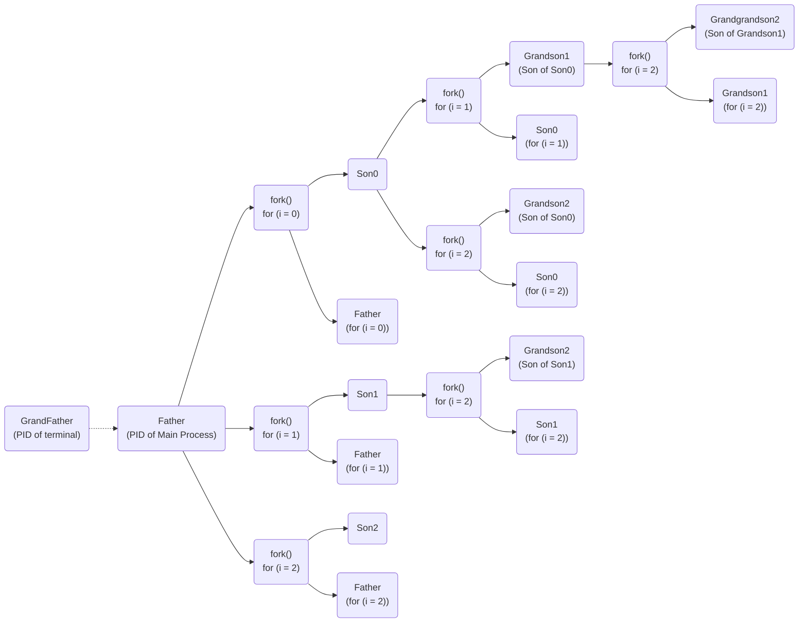

```mermaid
graph LR
    Grandfather("GrandFather\n(PID of terminal)")
    Father("Father\n(PID of Main Process)")
    Father0("Father\n(for (i = 0))")
    Father1("Father\n(for (i = 1))")
    Father2("Father\n(for (i = 2))")
    Son0(Son0)
    Son1(Son1)
    Son2(Son2)
    Son01("Son0\n(for (i = 1))")
    Son02("Son0\n(for (i = 2))")
    Son12("Son1\n(for (i = 2))")
    Grandson01("Grandson1\n(Son of Son0)")
    Grandson02("Grandson2\n(Son of Son0)")
    Grandson12("Grandson2\n(Son of Son1)")
    Grandson012("Grandson1\n(for (i = 2))")
    Grandgrandson012("Grandgrandson2\n(Son of Grandson1)")
    Fatherfor0("fork()\nfor (i = 0)")
    Fatherfor1("fork()\nfor (i = 1)")
    Fatherfor2("fork()\nfor (i = 2)")
    Son0for1("fork()\nfor (i = 1)")
    Son0for2("fork()\nfor (i = 2)")
    Son1for2("fork()\nfor (i = 2)")
    Grandson1for2("fork()\nfor (i = 2)")

  
    Grandfather-.->Father
        Father-->Fatherfor0
            Fatherfor0-->Son0
            	Son0-->Son0for1
                Son0for1-->Grandson01
                	Grandson01-->Grandson1for2
                	Grandson1for2-->Grandgrandson012
                	Grandson1for2-->Grandson012
                Son0for1-->Son01
                Son0-->Son0for2
                Son0for2-->Grandson02
                Son0for2-->Son02
            Fatherfor0-->Father0
  
 		Father-->Fatherfor1
            Fatherfor1-->Son1
            	Son1-->Son1for2
                Son1for2-->Grandson12
                Son1for2-->Son12
            Fatherfor1-->Father1

        Father-->Fatherfor2
        	Fatherfor2-->Son2
        	Fatherfor2-->Father2
```