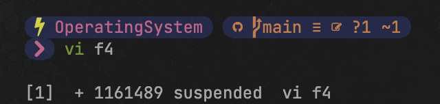
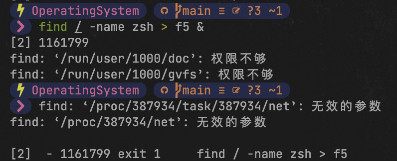
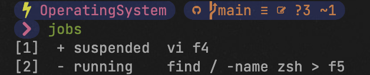
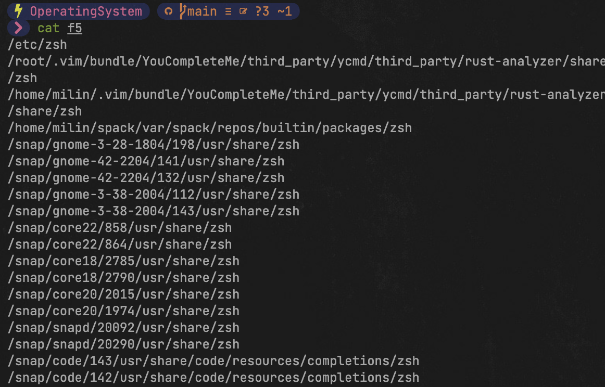
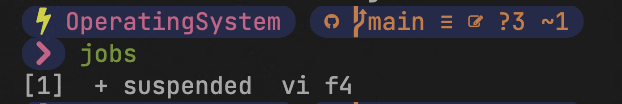

### 作业和进程的基本管理

#### 【操作要求 1】先在前台启动 vi 编辑器并打开 f4 文件，然后挂起，最后在后台启动一个查找 inittab 文件的 find 作业，find 的查找结果保存到 f5。

【操作步骤】

1. 以超级用户（root）身份登录到 RHEL Server 5 字符界面。

2. 输入命令“vi f4”，在前台启动 vi 文本编辑器并打开 f4 文件。

3. 按下 Ctrl+Z 组合键，暂时挂起“vi f4”作业，屏幕显示该作业的作业号(和进程号)。
   

   
图1.1 挂起作业号

4. 输入命令“find / -name zsh > f5 &”，启动一个后台作业，如下所示。在显示作业号的同时还显示进程号。

    

    
图1.2 挂起作业号/进程号

#### 【操作要求 2】查看当前作业、进程和用户信息，并对作业进行前后台切换。

【操作步骤】

1. 输入命令“jobs”，查看当前系统中的所有作业。

   
   
图1.3 查看作业

2. 输入命令“fg 2”，将“find / -name inittab > f5 &”作业切换到前台。屏幕显示出“find / -name inittab > f5”命令，并执行此命令。稍等片刻，作业完成后屏幕再次出现命令提示符。
   
       
图1.4 作业切换至前台

3. 输入命令“cat f5”，查看“find / -name zsh > f5”命令的执行结果。
     
图1.5 查看“find / -name zsh > f5”结果

4. 再次输入命令“jobs”，可发现当前系统中的只有一个已停止的作业“vi f4”。
       
           
图1.6 查看作业2

5. 输入命令“kill -9%1”，终止“vi f4”作业。

