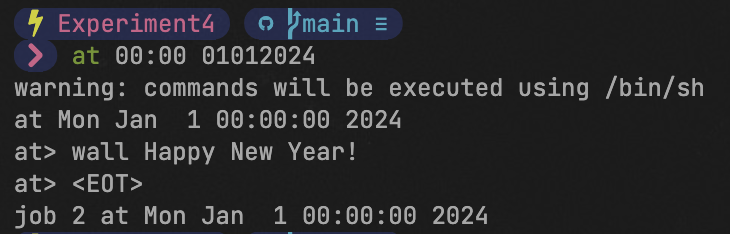
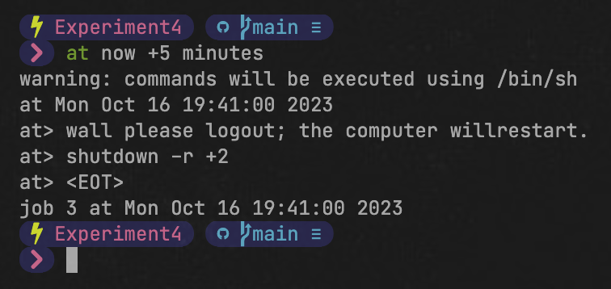
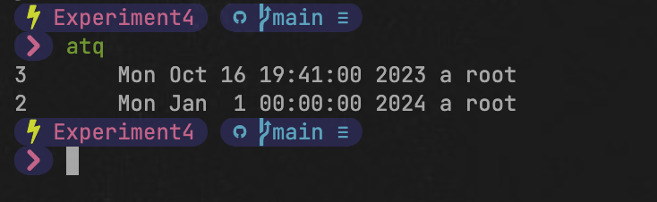
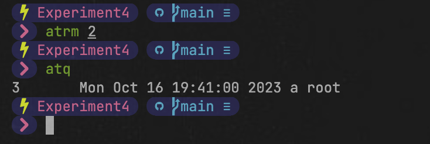

### at进程调度

所谓进程调度就是设定某个指定的作业在固定的时间、或者固定的频率，或者系统空闲时自动执行的操作。根据作业要求执行的条件不同，可选中不同的调度方式。

at调度: 在指定的时间执行一次特定的作业。
batch调度: 在系统空闲时执行一次特定的作业。
cron调度: 每到指定的时间就执行特定的作业，可执行多次。

#### 【操作要求 1】设置一个调度，要求在2024年1月1日0时，向所有用户发送新年快乐的问候。

【操作步骤】

1. 超级用户输入命令“at 00:00 01012024”，设置2024年1月1日0时执行的at调度的内容。

    at调度的时间表示方法如下所示:

    1. HH:MM: 即小时:分钟，如 09:17，采用 24 小时计时制。
    2. 数字 AM/PM: 采用 12 小时计时制，如 3am。
    3. MMDDYY或MM/DD/YY或DD.MM.YY: 指定具体的日期，必须写在具体时间之后。
    4. now+时间间隔: 指定距离现在的时间，时间单位为 minutes(分钟)，hours(小时)，day(天)，week(星期)。
    5. 具体时间: today(今天)、tomorrow(明天)、midnight(深夜)、noon(中午) teatime(下午 4 点)，Tuesday(周二)，July 11(7 月 11 日)。

2. 屏幕出现 at 调度的命令提示符“at>”，输入“wall Happy New Year!”，向所有用户 发送消息。

3. 光标移动到“at>”提示符的第三行，按下 Ctrl+D 组合键结束输入。根据调度设置的 时间，最后显示出作业号和将要运行的时间。
   

   
图2.1 at调度的时间表示

#### 【操作要求 2】设置一个调度，要求 5 分钟后向所有用户发送系统即将重启的消息，并在 2 分钟后重新启动计算机。

【操作步骤】

1. 超级用户输入命令“at now +5 minutes”，设置5分钟后执行的at调度的内容。

2. 屏幕出现at调度的命令提示符“at>”，输入“wall please logout; the computer willrestart.”，向所有用户发送消息。

3. 在“at>”提示符的第二行输入“shutdown –r +2”，系统2分钟后将重新启动。“shutdown –r +2”命令与“reboot +2”命令效果相同，都是在2分钟后重新启动。

4. 光标移动到“at>”提示符的第三行，按下Ctrl+D组合键结束输入。最后显示作业号和运行时间。

   
   
图2.2 at调度设置

#### 【操作要求 3】查看所有的at调度，并删除24年1月1日执行的调度任务。

【操作步骤】

1. 输入“atq”命令，查看所有的at调度，显示出作业号、将在何时运行以及at调度的设定者。

   
   
图2.3 at调度查看

2. 输入“atrm 2”命令删除作业号为2的at调度，并再次输入“atq”命令查看剩余的所有at调度内容。

   
   
图2.4 at调度删除

3. 5分钟后系统将自动运行作业号为2的at调度内容。先向所有用户发送消息，然后再等2分钟重新启动。