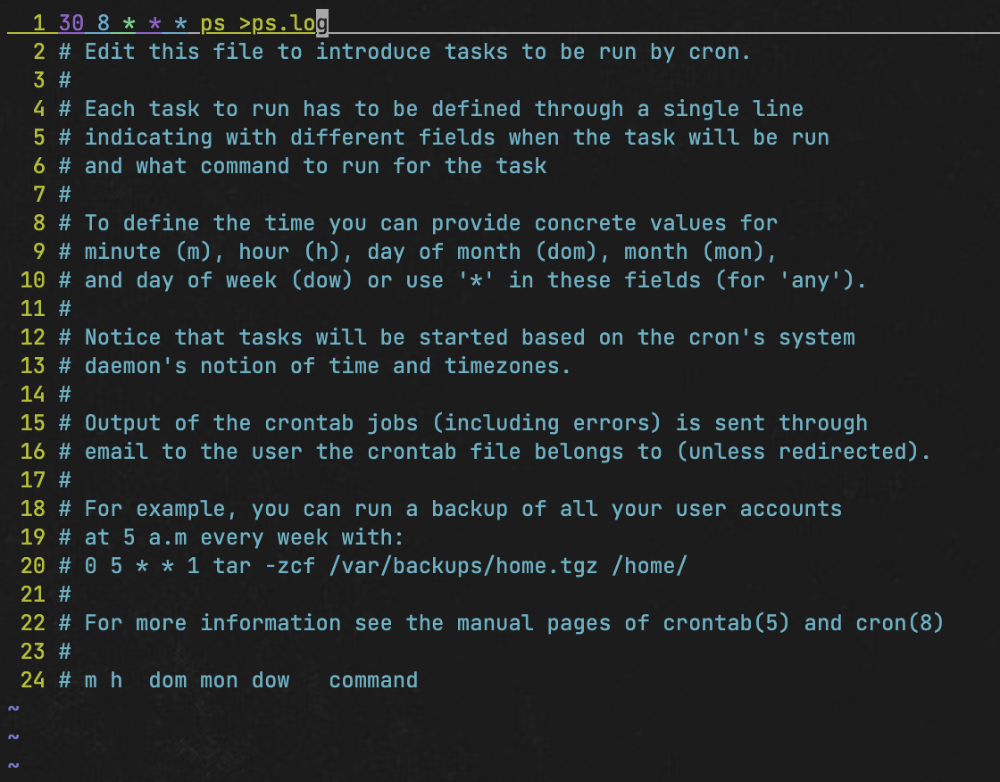
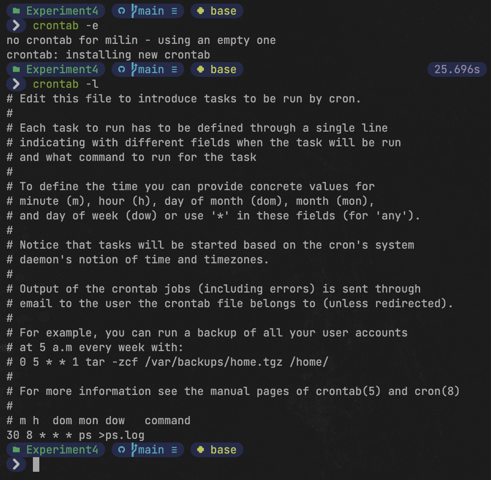
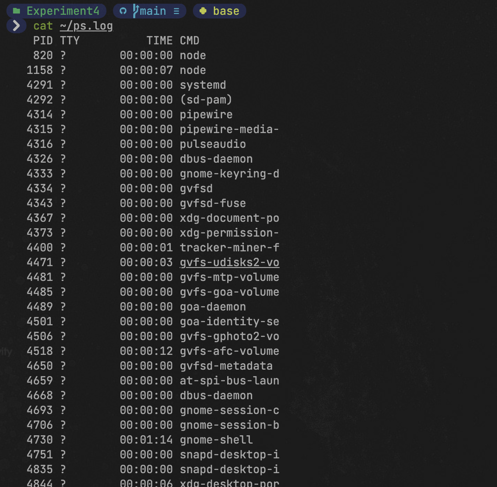
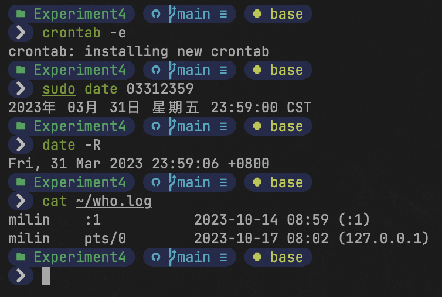
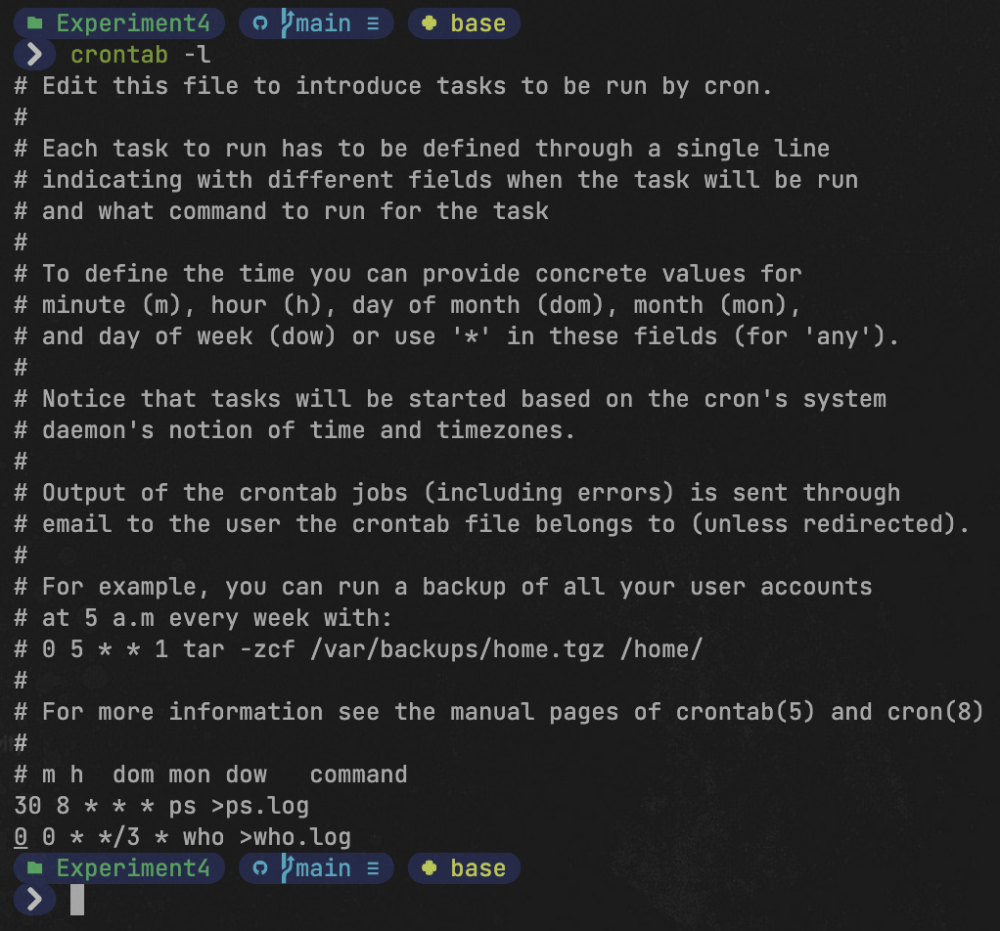
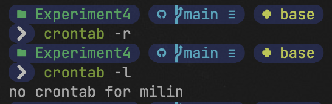

### cron进程调度

cron 调度的内容共有 6 个字段，从左到右依次为分钟、小时、日期、月份、星期和命令。

表3.1 crontab文件的格式

| 字段     | 分钟 | 小时 | 日期  | 月份  | 星期           | 命令 |
| -------- | ---- | ---- | ----- | ----- | -------------- | ---- |
| 取值范围 | 0~59 | 0~23 | 01~31 | 01~12 | 0~6，0为星期天 | ...  |

在设置cron调度时，所有的字段都不能为空，字段之间用空格分开，如果不指定字段内容，则使用“*”符号。

使用“-”符号表示一段时间。如果在日期栏中输入“1-5”则表示每个月前5天每天都要执行该命令。

使用“,”符号表示指定的时间。如果在日期栏中输入“5,15,25”则表示每个月的5日、15日和25日都要执行该命令。

使用“/”符号表示间隔频率，如果在小时栏中输入“*/2”，表示某2小时执行一次该命令。

#### 【操作要求 1】milin用户设置crontab调度，要求每天上午8点30份查看系统的进程状态，并将查看结果保存于ps.log文件。

【操作步骤】

1. 以普通用户milin登录，并输入命令“crontab –e”，新建一个crontab配置文件。

2. 屏幕出现vi编辑器，按下“i”，进入输入模式，输入“30 8 * * * ps >ps.log ”。

    

    
图3.1 crontab添加调度

3. 按下Esc键退出vi的文本输入模式，并按下“:”键切换到最后行模式，输入“wq”，保存并退出编辑器，显示“crontab: installing new crontab”信息。

4. 输入命令“crontab -l”，查看milin用户的 cron 调度内容。

    

    
图3.2 crontab查看调度

5. 为立即查看到crontab调度的结果，切换为超级用户，并适当修改系统时间，如修改

    为 8 点 29 分。最后退回到milin用户。

6. 等待1分钟后，查看ps.log文件的内容，如果显示出正确的内容，那么说明crontab调度设置成功。
    

    
图3.3 查看通过调度保存的日志1

#### 【操作要求 2】milin用户添加设置crontab调度，要求每三个月的1号零时查看正在使用的 用户列表。

【操作步骤】

1. 再次输入命令“crontab –e”，出 现 vi 编辑器，按下“i”，屏幕进入文本输入模式。

2. 在原有内容之后，另起一行，输入“0 0 * */3 * who >who.log ”。

3. 最后保存并退出vi编辑器。

4. 为立即查看到crontab调度的结果，切换为超级用户，并适当修改系统时间，如修改为3月31日23点59分。最后退回到milin用户。

5. 等待1分钟后，查看who.log文件的内容，如果显示出正确的内容，那么说明新增加的crontab调度设置成功。

   
   
图3.4 查看通过调度保存的日志2

#### 【操作要求 3】查看cron调度内容，最后删除此调度。

【操作步骤】

1. 输入命令“crontab -l”，查看cron调度内容。

   
   
图3.5 cron查看调度内容

2. 输入命令“crontab -r”，删除cron调度内容。

3. 再次输入命令“crontab -l”，此时无cron调度内容

   
   
图3.6 cron调度删除

   