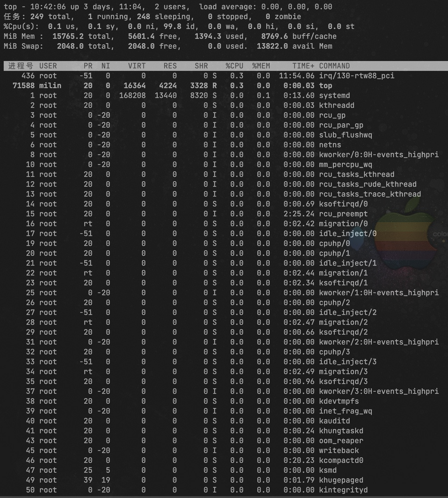
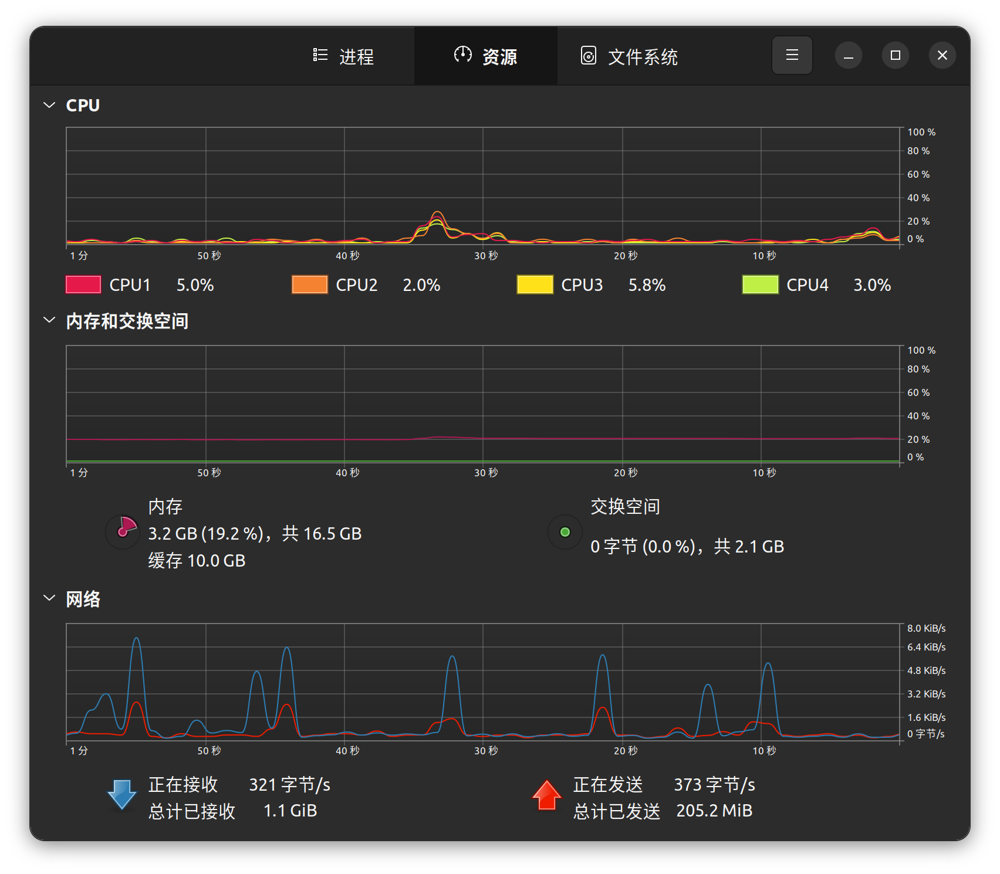
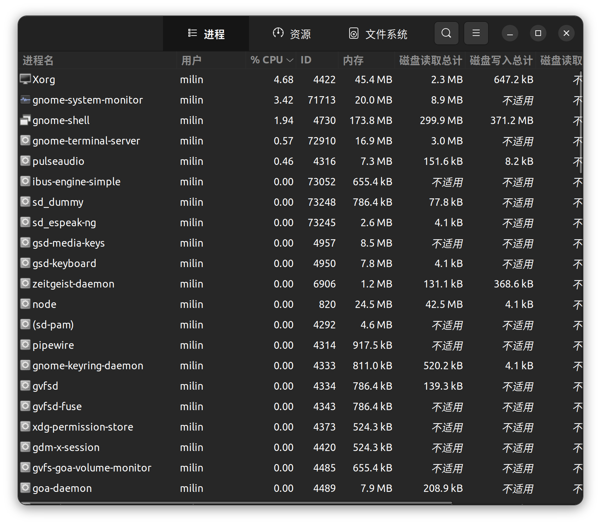
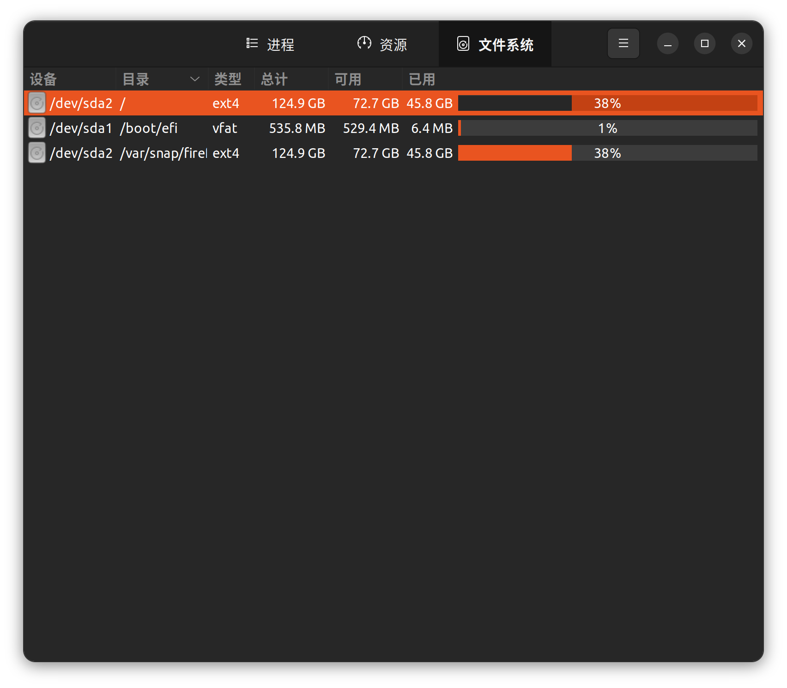
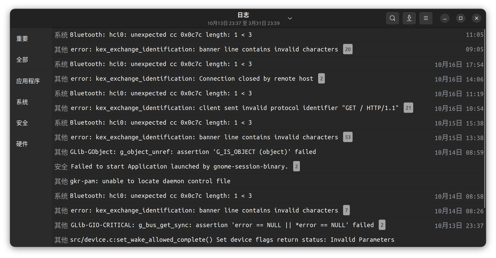

### 系统性能监视

#### 【操作要求 1】利用Shell命令监视系统性能

【操作步骤】

1. 输入命令“top”，屏幕动态显示CPU利用率、内存利用率和进程状态等相关信息

    

    
图4.1 top监视系统性能

2. 按下M键，所有进程按照内存使用率排列

    ")

    
图4.2 top监视系统性能(内存排序)

3. 按下T键，所有进程按照执行时间排列

    ")

    
图4.3 top监视系统性能(执行时间排序)

4. 最后按下P键，恢复按照CPU使用率排列所有进程

5. 按下CTRL+C组合键结束top命令。

#### 【操作要求 2】利用「系统监视器」工具监视 CPU 使用情况

【操作步骤】

1. 启动GNOME桌面环境，依次单击「系统」菜单=>「管理」=>「系统监视器」，打 开「系统监视器」窗口。

2. 自动显示「资源」选项卡，查看当前CPU、内存和交换分区、网络历史的使用情况。

    
    
图4.4 查看资源信息

#### 【操作要求 3】利用「系统监视器」查看当前所有的进程，要求显示出启动进程的用户

【操作步骤】

1. 在「系统监视器」窗口单击「进程列表」选项卡，默认显示当前用户启动的所有进程。单击「查看」菜单，选中「所有的进程」单选按钮，并选中「依赖关系」复选框， 则显示系统中所有的进程。

    

    
图4.5 查看当前所有的进程

2. 单击「编辑」菜单中的「首选项」，弹出「系统监视器首选项」对话框。在「进程」选项卡，选中「进程域」栏的「用户」复选框，要求显示出启动进程的用户。单击「关闭」按钮，显示进程的各种信息。

#### 【操作要求 4】利用「系统监视器」查看所有的文件系统

【操作步骤】

1. 在「系统监视器」窗口单击「文件系统」选项卡，显示当前Ubuntu22.04.06系统中主要的文件系统。

2. 单击「编辑」菜单中的「首选项」，弹出「系统监视器首选项」对话框。在「文件系统」选项卡，选中「显示全部文件系统」复选框，要求显示出全部的文件系统。最后单击「关闭」按钮。

3. 「文件系统」选项卡显示全部的文件系统的信息。

    

    
图4.6 查看文件系统

#### 【操作要求 5】利用「系统日志」工具查看系统日志

​	系统日志文件都保存于/var/log 目录中，包括以下重要的日志文件: 
​	boot.log		记录系统引导的相关信息
​	cron			记录 cron 调度的执行情况
​	dmesg			记录内核启动时的信息，主要包括硬件和文件系统的启动信息
​	maillog		记录邮件服务器的相关信息
​	messages		记录系统运行过程的相关信息，包括 I/O、网络等
​	rpmpkgs		记录已安装的 RPM 软件包信息
​	secure记录系统安全信息
​	Xorg.0.log记录图形化用户界面的 Xorg 服务器的相关信息

【操作步骤】

​	超级用户依次单击「系统」菜单=>「管理」=>「系统日志」，打开「系统日志」窗口。可分别查看各类系统日志。

图4.7 查看系统日志
