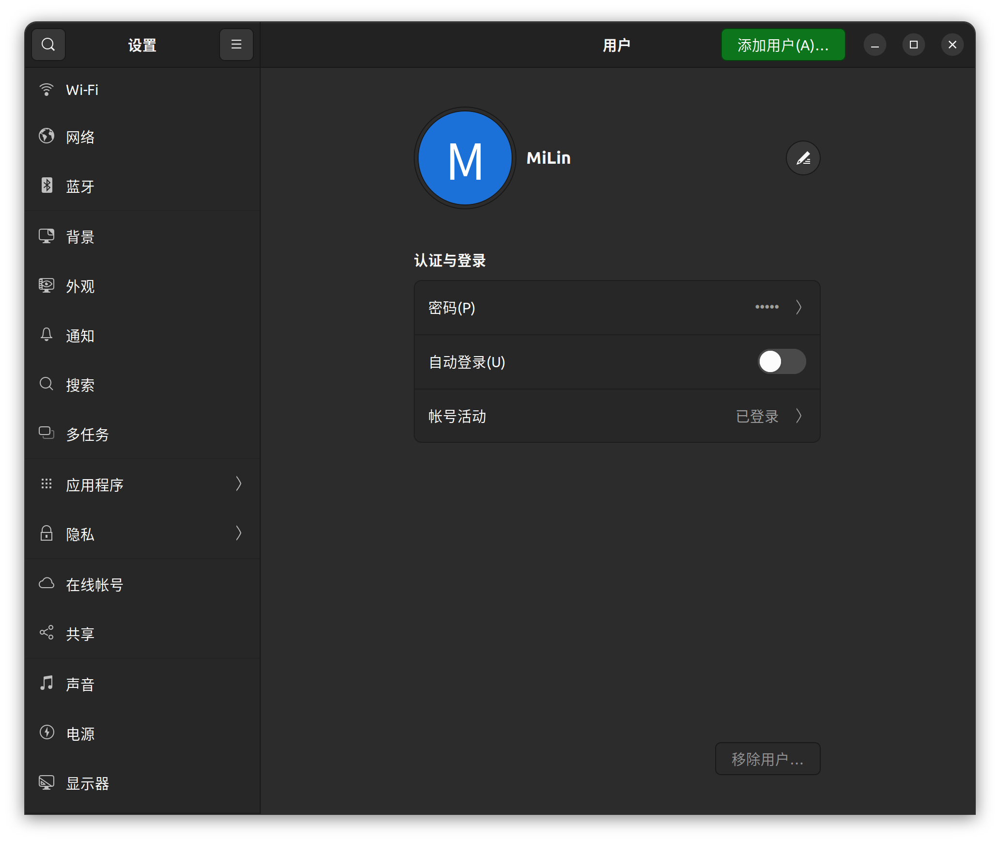
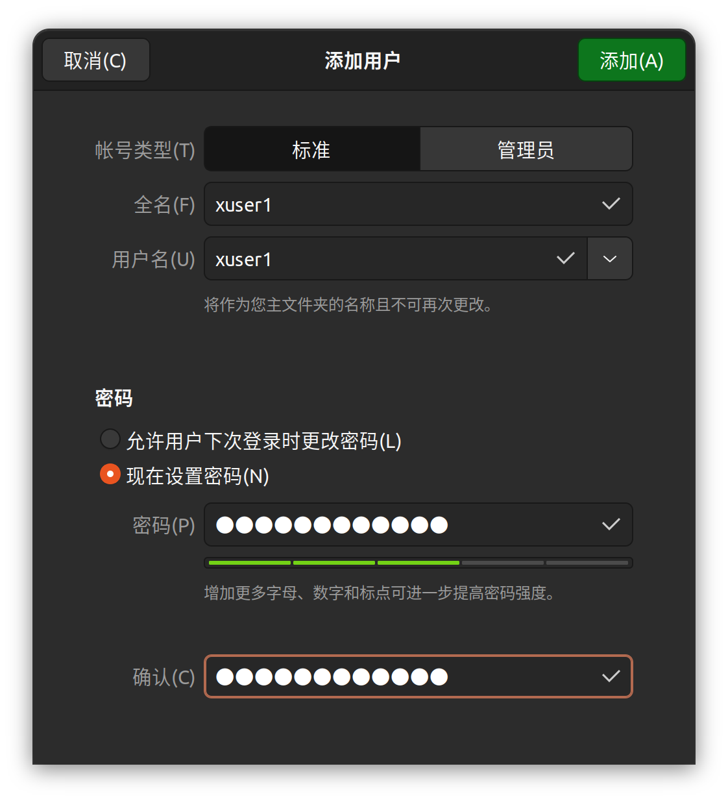
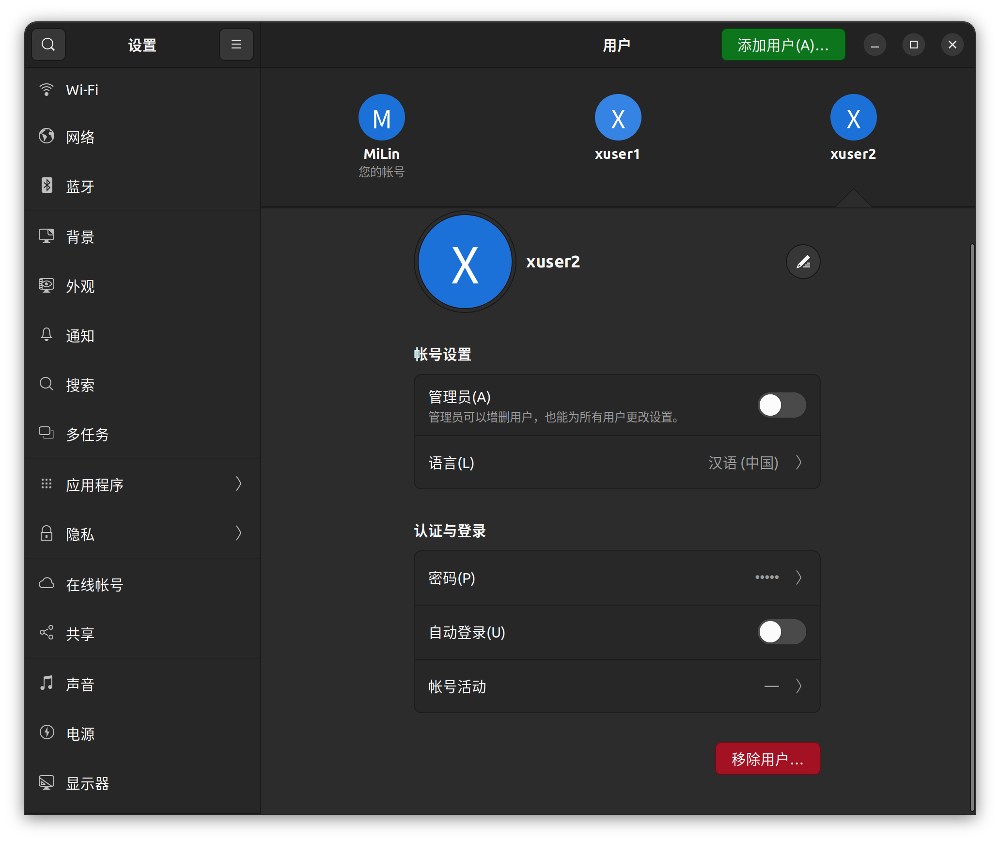
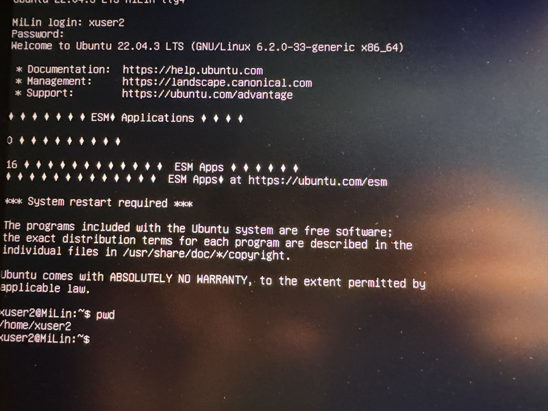
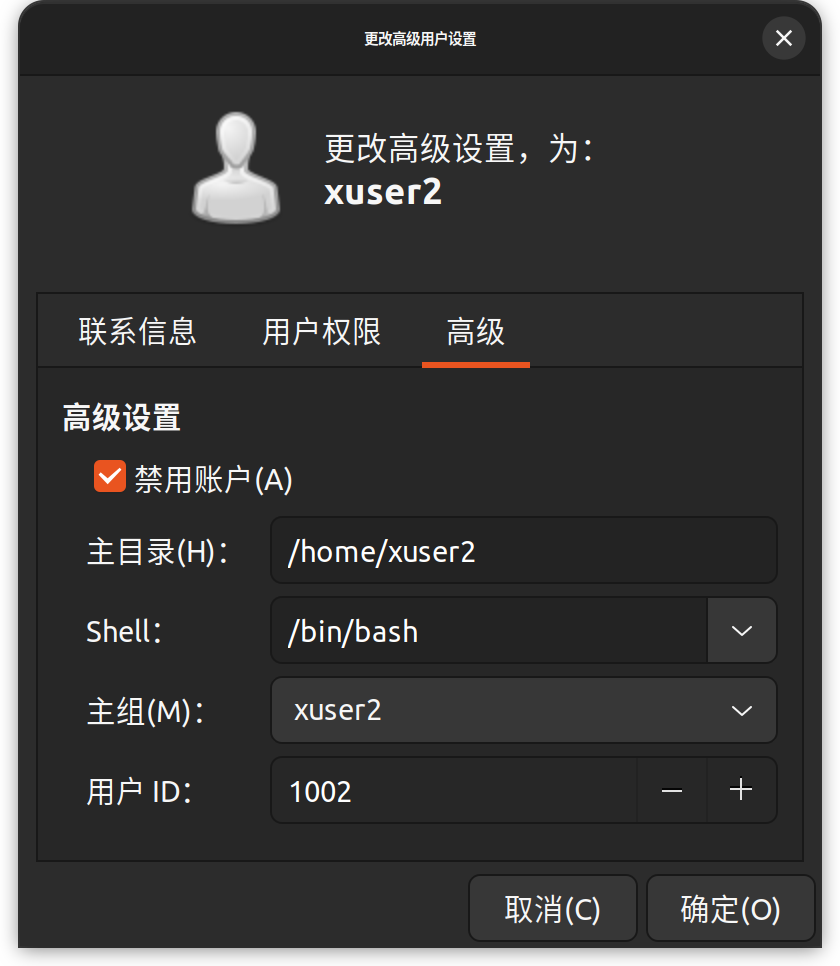
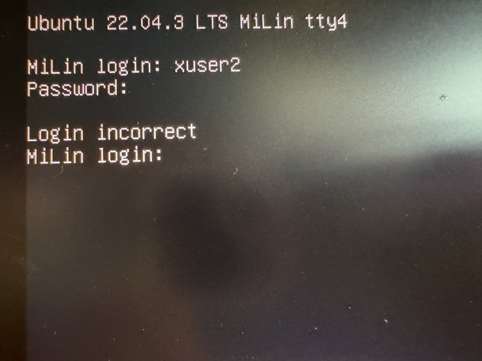
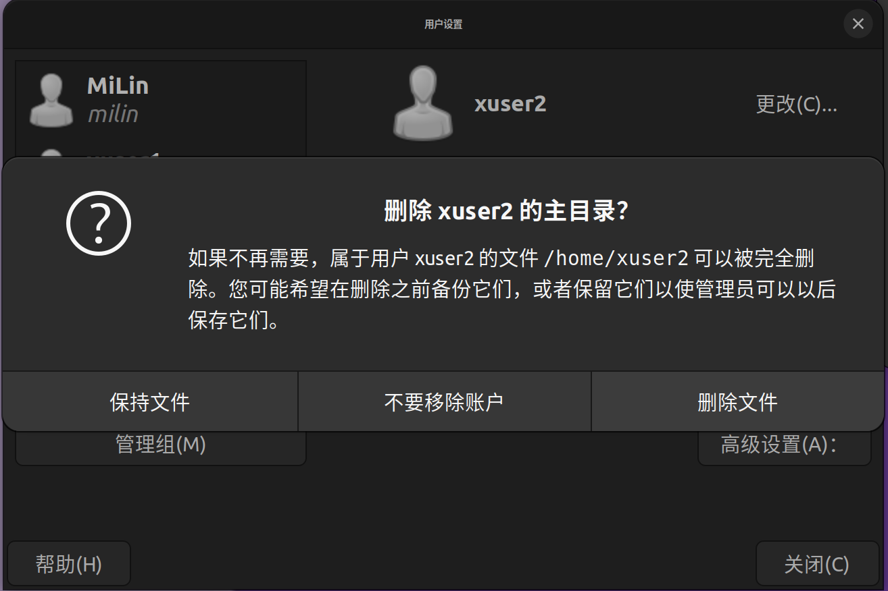
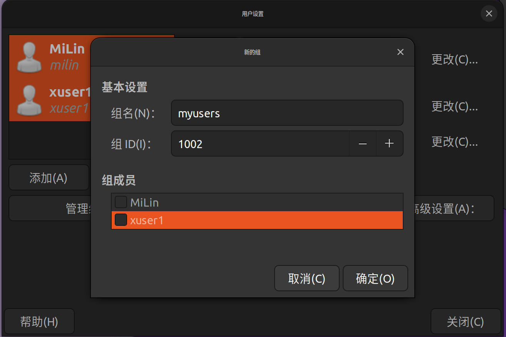
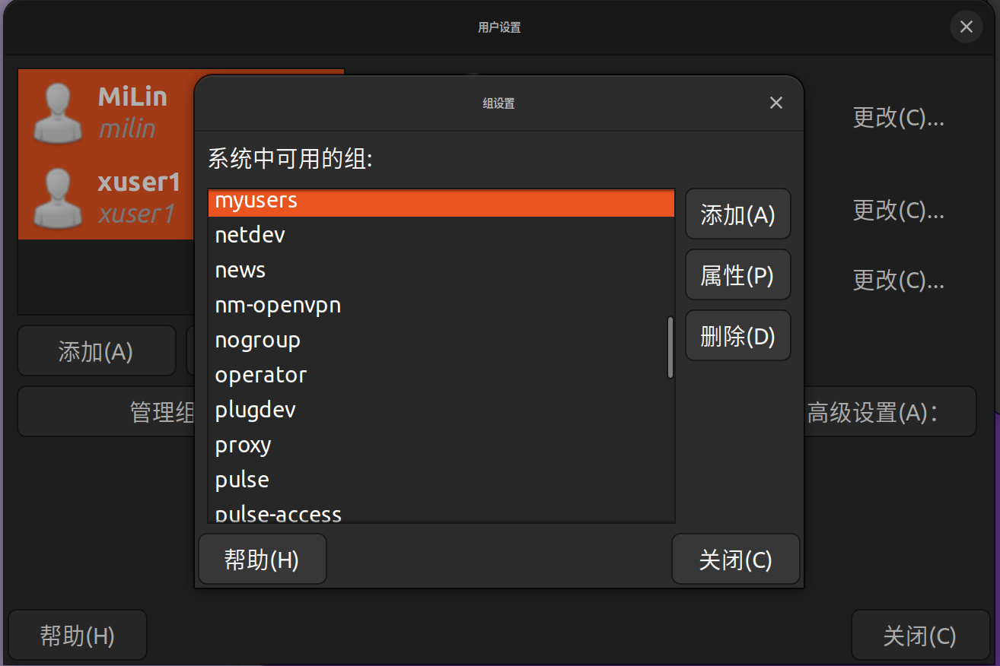
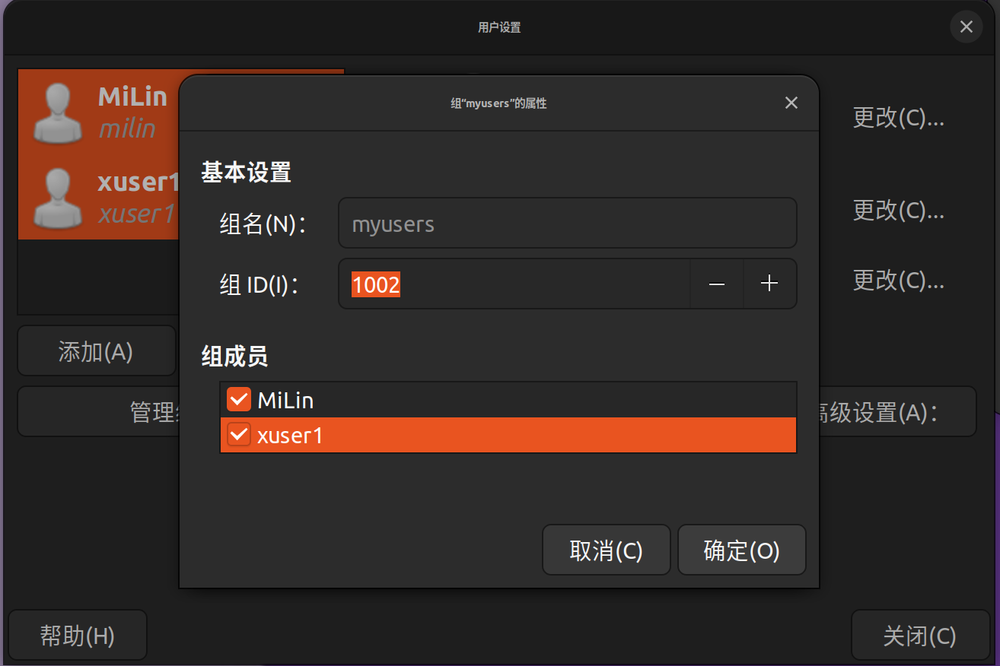

### 桌面环境下管理用户与组群

#### 【操作要求 1】新建两个用户帐号，其用户名为xuser1和xuser2，口令为“e12ut59er”和 “wfu1t28er”。

【操作步骤】

1. 以超级用户身份登录 X Window 图形化用户界面，依次单击「系统」菜单=>「管理」=>「用户和组群」，启动「用户管理者」窗口。
   

   
图1.1 打开用户管理者窗口

   

   
图1.2 添加xuser1用户

2. 单击工具栏上的「添加用户」按钮，出现「创建新用户」窗口。在「用户名」文本框中输入用户名“xuser1”，在「口令」文本框中输入口令“e12ut59er”，在「确认口令」 文本框中再次输入口令“e12ut59er”，如图 5-2 所示，然后单击「确定」按钮，返回「用 户管理者」窗口。

3. 用同样的方法新建用户xuser2，完成后「用户管理者」窗口。

   
   
图1.3 完成用户添加

4. 依次单击顶部面板的「应用程序」=>「附件」=>「文本编辑器」，启动gedit文本编辑器，打开/etc/passwd和/etc/shadow文件将发现文件的末尾出现表示xuser1和xuser2用户帐号的信息。打开/etc/group 和/etc/gshadow 文件将发现文件末尾出现表示 xuser1 和 xuser2 私人组群的信息。

5. 按下CTRL+ALT+F4组合键切换到第4个虚拟终端，输入用户名xuser2和相应的口令可登录Linux系统，说明新建用户操作已成功。

6. 输入“pwd”命令，屏幕显示用户登录后进入用户主目录“/home/xuser2”，操作内容如下所示。

   

   
图1.4 新用户登录

7. 输入“exit”命令，xuser2用户退出登录

8. 按下CTRL+ALT+F2组合键返回GNOME桌面环境。

#### 【操作要求 2】锁定xuser2用户帐号

【操作步骤】

1. 在「用户管理者」窗口选中xuser2用户帐号，单击工具栏上的「属性」按钮，打开「用户属性」窗口。

2. 选中「帐号信息」选项卡让「本地口令被锁」复选框被选中。单击「确定」按钮，返回「用户管理者」窗口。

   
   
图1.5 锁定xuer2用户

3. 按下 CTRL+ALT+F4 组合键，再次切换到第4个虚拟终端，输入用户名xuser2和相应的口令，发现xuser2用户无法登录Linux系统，说明xuser2用户账号的确已被锁定，操作内容如下所示: 

   
   
图1.6 验证锁定

4. 按下CTRL+ALT+F2组合键再次返回GNOME桌面环境。

#### 【操作要求 3】删除xuser2用户

【操作步骤】

1. 在「用户管理者」窗口，单击「编辑」菜单的「首选项」，弹出「首选项」对话框，不选中「隐藏系统用户和组」复选框，最后单击「关闭」按钮。此时「用户」选项卡中显示包括超级用户和系统用户在内的所有用户。

2. 在「搜索过滤器」文本框中输入“x\*”并按下 Enter 键，则仅显示以 x 为首字母的用户。

3. 选中xuser2用户，单击工具栏上的「删除」按钮，弹出对话框，单击「是」按钮，返回「用户管理者」窗口，发现xuser2用户已被删除。

   
   
图1.7 确认删除xuser2用户

4. 按下CTRL+ALT+F2组合键再次返回GNOME桌面环境。

#### 【操作要求 4】新建两个组群，分别是 myusers 和 temp

【操作步骤】

1. 在「用户管理者」窗口选中「组群」选项卡，当前显示出所有组群。

2. 单击工具栏上的「添加组群」按钮，出现「创建新组群」对话框。在「组群名」文本框中输入“myusers”，单击「确定」按钮，返回「用户管理者」窗口。

3. 用相同的方法新建 temp 组群，完成后「用户管理者」窗口。

   
   
图1.8 新建组群

   
   
图1.9 完成组群新建

#### 【操作要求5】修改myusers组群属性，将xuser1和milin用户加入myusers组群

【操作步骤】

1. 从「组群」选项卡中选择myusers组群，单击工具栏上的「属性」按钮，弹出「组群属性」窗口。

2. 选择「组群用户」选项卡，选中milin和xuser1前的复选框，设置milin用户和xuser1用户的myusers组群的成员。单击「确定」按钮，返回「用户管理者」窗口

   
   
图1.10 向组群添加用户

#### 【操作要求6】删除temp组群

【操作步骤】
	从「组群」选项卡中选择temp组群，单击工具栏上的「删除」按钮，出现确认对话框， 单击「是」按钮即可。

   

   
图1.11 删除temp组群

   
