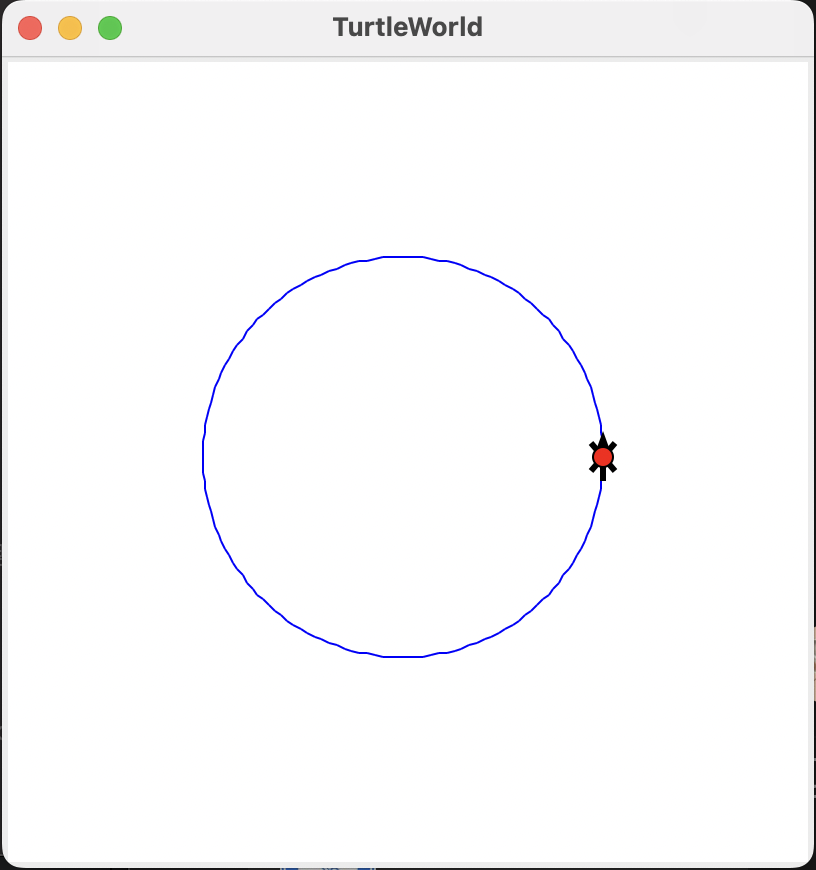
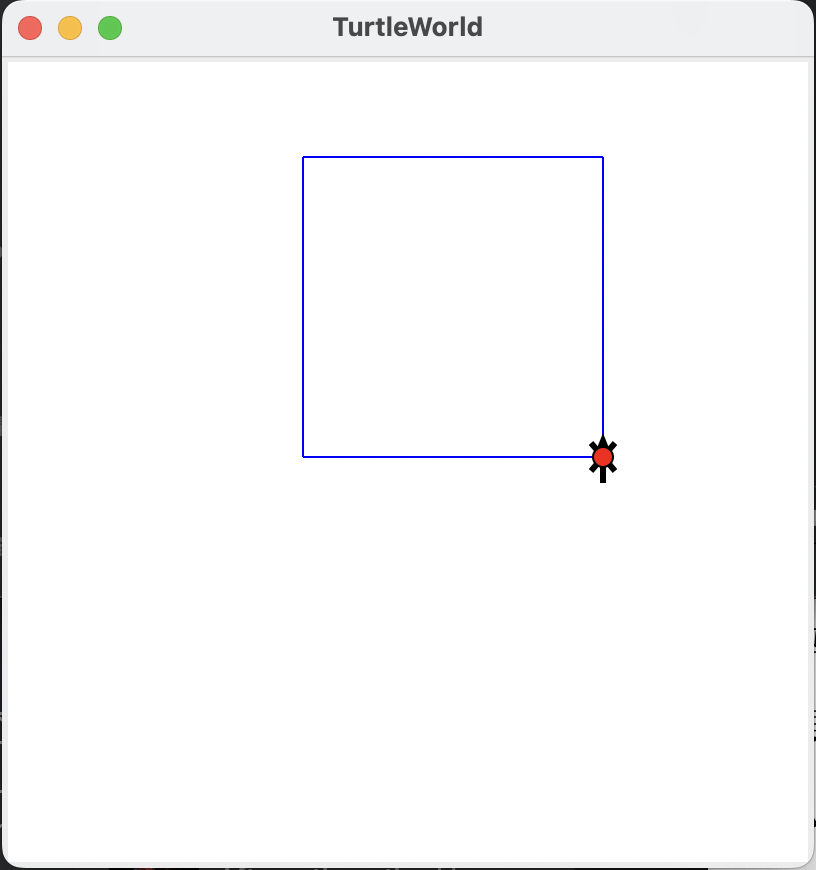
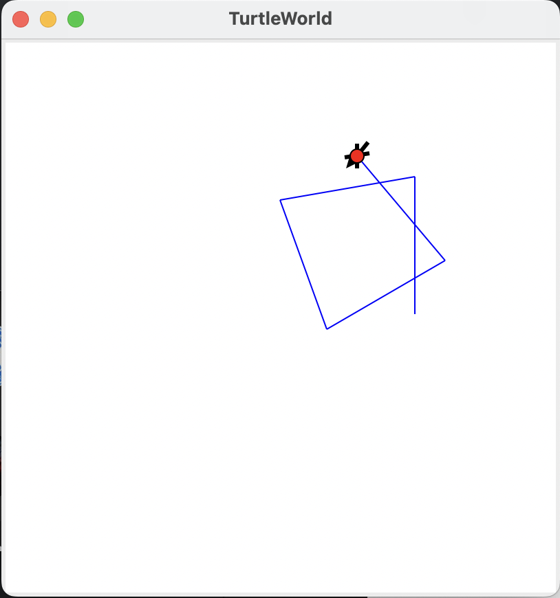
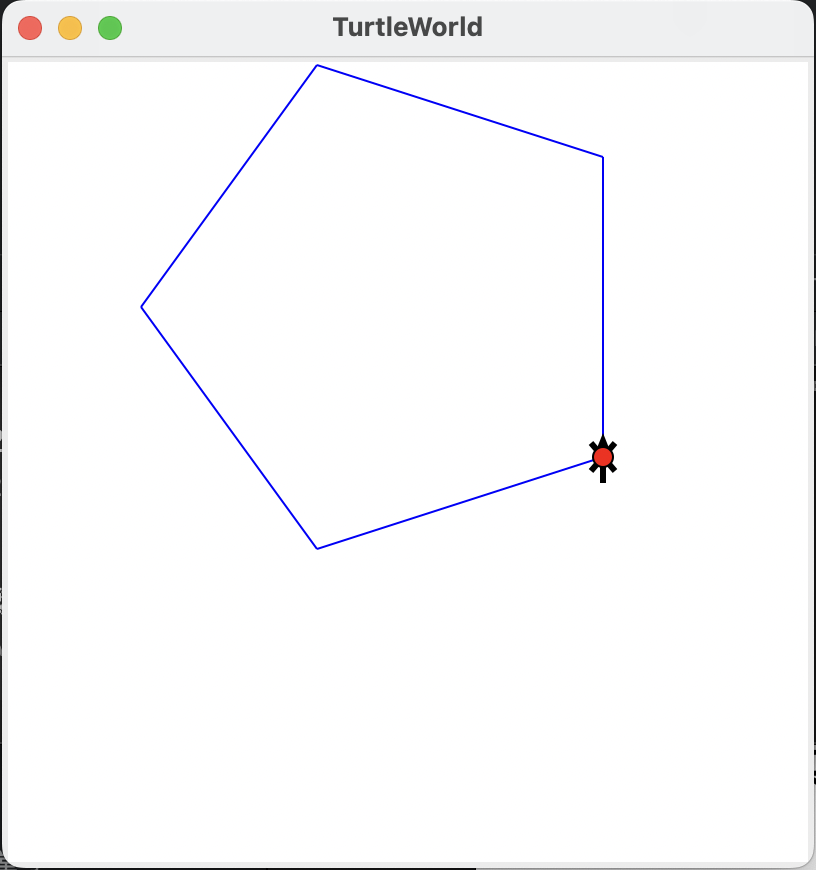
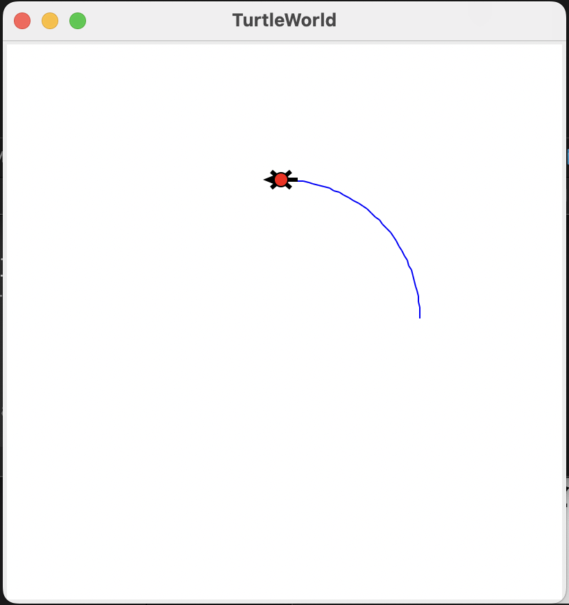

# **Python 计算实验报告**

## **实验目的与要求**

### 熟悉 Python 的开发调试环境

### 熟悉 Python 外部库的调用

### 掌握 Python 语言基本语法

### 熟悉 Python 的数据结构

## **实验环境**

    系统：MacOS 13.2.1 (22D68)
    
    硬件：Apple M1，8G
    
    Python版本：anaconda Python 3.9.6

## **实验内容**

### **Python 代码理解 polygon.py：**

    （1）运行和阅读代码；
    （2）理解代码功能；
    （3）修改代码，练习调用文件中其他几个图形函数

### **输入输出：**

    编写脚本文件，设计友好的用户输入输出提示，用户输入一个时间（24小时制，包含时、分、秒），输出1秒后的时间。

### **反序对：**

    如果一个单词是另一个单词的反向序列，则称这两个单词为“反向对”。编写代码输出word.txt中词汇表包含的反向对。

### **文本分析算法设计：**

    （1）设计Python程序读入一个英文单词组成的文本文件，统计该文本文件中各个单词出现的次数。设计测试用例验证代码的正确性。
    （2）设计Python程序读入一个英文单词组成的文本文件，统计其中包含的某给定关键词列表中各个单词出现的频率。设计测试用例验证代码的正确性。

## **实验内容的设计与实现**

### Python 代码理解 polygon.py：

    （1）运行和阅读代码；
    （2）理解代码功能；
    （3）修改代码，练习调用文件中其他几个图形函数

#### **程序设计特点**

    无

#### **函数测试：**

```python
if __name__ == '__main__':
    world = TurtleWorld()

    bob = Turtle()
    bob.delay = 0.001

    # draw a circle centered on the origin
    radius = 100
    length = 150
    pu(bob)
    fd(bob, radius)
    lt(bob)
    pd(bob)
    # 以此测试一下函数：
    # circle(bob, radius)
    # square(bob, length)
    # polyline(bob, n = 5, length = length, angle = 100)
    # polygon(bob, n = 5, length = length)
    # arc(bob, r = radius, angle = 90)

    wait_for_user()
```

    结果分别为：

<div align="center">
    
    
    
</div>

<div align="center">
    
    
</div>


#### **函数/代码分析：**

**`TurtleWorld`函数解释：**

1. `Turtleworld()`：新建 `Turtleworld()`画布
2. `Turtle()`：新建 `Turtle()`对象
3. `fd(t: Turtle(), length: float)`：
   令当前 `TurtileWorld()`对象 `t`向前移动 `length`个单位
4. `lt(t: Turtle(), angle = 90.0: float)`：
   令当前 `TurtileWorld()`对象 `t`向逆时针转 `angle`度(默认为$90\degree$)
5. `rt(t: Turtle(), angle = 90.0: float)`：
   令当前 `TurtileWorld()`对象 `t`向顺时针转 `angle`度(默认为$90\degree$)

**自定义函数解释：**

1. `square(t: Turtle(), length: float)`：
   令当前 `TurtileWorld()`对象 `t`在左侧逆时针绘制边长为 `length`的正方形
2. `polyline(t: Turtle(), n: float, length: float, angle: float)`：
   令当前 `TurtileWorld()`对象 `t`在左侧逆时针绘制边长为 `length`的 `n`次折线段，折线之间的夹角为 `angle`
3. `polygon(t: Turtle(), n: float, length: float)`：
   令当前 `TurtileWorld()`对象 `t`在左侧逆时针绘制边长为 `length`的 `n`边形
4. `arc(t: Turtle(), r: float, angle: float)`：
   令当前 `TurtileWorld()`对象 `t`在左侧逆时针绘制与当前方向相切的半径为 `r`，圆心角为 `angle`的圆弧
5. `circle(t: Turtle(), r: float)`：
   令当前 `TurtileWorld()`对象 `t`在左侧逆时针绘制与当前方向相切的半径为 r 的圆

### **输入输出：**

    编写脚本文件，设计友好的用户输入输出提示，用户输入一个时间（24小时制，包含时、分、秒），输出1秒后的时间。

#### **程序设计特点：**

    使用了正则表达式判断用户输入是否符合规定格式，在用户输入输出时有清晰的提示。

#### **源代码片段展示：**

```python
from re import match

string = input("请输入一个24小时制时间, 用:(英文)分隔时分秒\
				(HH:MM:SS): ").strip()

while True:
    if match(r"(([0, 1]\d)|(2[0-3]))(:[0-5]\d){2}", string) == None:
        string = input("时间格式有误, 请重新输入: ").strip()
    else:
        break

hour, minute, second = [int(i) for i in string.split(":")]

second += 1
if second == 60:
    second = 0
    minute += 1
    if minute == 60:
        minute = 0
        hour += 1
        if hour == 24:
            hour = 0

print(f"一秒后的时间为：{hour:0>2}:{minute:0>2}:{second:0>2}")
# ----------------------------输出-----------------------------
# 1.
# 请输入一个24小时制时间, 用:(英文)分隔时分秒(HH:MM:SS): 25:0:0
# 时间格式有误, 请重新输入: 00:00:00
# 一秒后的时间为：00:00:01
# 2.
# 请输入一个24小时制时间, 用:(英文)分隔时分秒(HH:MM:SS): 00:00:59
# 一秒后的时间为：00:01:00
# 3.
# 请输入一个24小时制时间, 用:(英文)分隔时分秒(HH:MM:SS): 23:59:59
# 一秒后的时间为：00:00:00
```

#### **函数/代码分析：**

    正则表达式`(([0, 1]\d)|(2[0-3]))(:[0-5]\d){2}`用于匹配符合 `HH:MM:SS`形式的字符串，确保输入的时间格式正确。
    	使用选择嵌套，正确判断一秒后的的时间。

### **反序对：**

    如果一个单词是另一个单词的反向序列，则称这两个单词为“反向对”。编写代码输出word.txt中词汇表包含的反向对。

#### **程序设计特点：**

    字典(`dict`)是Python中内置的一种特殊的基础数据结构，形式为 `{(key): (value), ...}`，其内核为哈希表，原理为通过将键(`key`)使用一个特殊的哈希函数的处理，使其可以做到$O(1)$的访问字典内元素，因此可以使用这一特性查找 `key`是否在字典中，代价是内存占用率增加。
    	而Python中的列表(`list`)的内核为数组，查找元素的速度为$O(n)$，显然查找效率更低。

```python
import time

key = [i for i in range(100000)]
value = [i for i in range(99999, -1, -1)]

dict_test = dict(zip(key, value))
list_test = key

start_time = 0
dict_cost = 0
list_cost = 0

start_time = time.time()
50000 in dict_test
dict_cost = time.time() - start_time

start_time = time.time()
50000 in list_test
list_cost = time.time() - start_time

print(f'The cost of visit 222 in list_test is {list_cost}')
print(f'The cost of visit 222 in dict_test is {dict_cost}')

# ----------------------------输出-----------------------------
# The cost of visit 222 in list_test is 0.0005829334259033203
# The cost of visit 222 in dict_test is 6.198883056640625e-05
```

    因此可以利用该特性，加快反序对的查找。

#### **源代码片段展示：**

```python
# file为word.txt
data = [i.rstrip() for i in file.readlines()] 	# 字符串预处理
rdata = {i[::-1]: i for i in data} 				# 倒置data中每个字符串
ans = []
for word in data:
    if word in rdata:							# 查找到word存在反序对
        ans.append(word)
        rdata.pop(word[::-1])	# 删除已经查找到的字符串的反序对，防止重复查找
        ans = [[i, i[::-1]] for i in ans]
```

#### **函数/代码分析：**

    通过将数据文件word.txt中每个字符串逆置($O(n)$)，而后以逆置单词为 `key`，以对应的原字符串为 `value`构成 `dict`($O(n)$)，最后遍历原字符串列表，查找 `dict`中是否有与其对应的 `key`($O(1)$)，若有则说明该单词在原字符串列表中存在单词能与其构成反序对。

### **文本分析算法设计：**

    （1）设计Python程序读入一个英文单词组成的文本文件，统计该文本文件中各个单词出现的次数。设计测试用例验证代码的正确性。
    （2）设计Python程序读入一个英文单词组成的文本文件，统计其中包含的某给定关键词列表中各个单词出现的频率。设计测试用例验证代码的正确性。

#### **程序设计特点：**

    定义了`WordFrequencyNum(string: str)`和 `WordFrequency(pat: str, string: str)`两个函数，分别用于统计字符串 `string`中各个单词出现的频数和字符串 `string`中单词 `pat`出现的频率。且利用函数的嵌套，减少代码量，便于代码设计以及理解。

#### **源代码片段展示：**

```python
def WordFrequencyNum(string: str) -> dict:
    try:
        import re
    except ImportError:
        print("导入re模块错误!")
    alphabet = {}
    words = re.findall(r"\w+", string)
    for i in words:
        alphabet[i] = alphabet[i] + 1 if i in alphabet else 1
    return alphabet

def WordFrequency(pat: str, string: str) -> float:
    alphabet = WordFrequencyNum(string)
    words_num = sum(alphabet.values())
    if pat in alphabet:
        return alphabet[pat] / words_num
    else:
        return 0.0
```

#### **函数/代码分析：**

`WordFrequencyNum(string: str)`：
计算各个单词出现的次数时，使用正则表达式提取文本中的单词，并将每个单词作为字符串保存到一个列表 `words`中。而后遍历 `words`，若 `words`中的元素 `word`不存在字典 `alphabet`中，则新建键值对 `(word): 1`，否则对以 `word`为键的值加一。
`WordFrequency(pat: str, string: str)`：
计算各个单词出现的频率时，由于统计所有单词的出现次数与统计单个单词出现次数时间复杂度相同，因此调用 `WordFrequencyNum(string: str)`，获取其所有词的词频。查询 `alphabet`中 `pat`的频数并使用 `sum(alphabet.values())`求出单词总数，最后将其相除得出答案。

## **测试用例：**

    本次实验中第四题的测试用例为[Storms Always Give Way to the Sun.txt](https://www.doc88.com/p-188616908515.html)。

## **收获与体会**

    通过本次实验，我对Python的库函数的导入与运用、字符串处理与正则表达式、列表与字典等基础功能有了一定的理解，通过练习与实验，我深刻的体会到程序只有在了解了其运行的底层机制后才能更好的对其进行优化。
