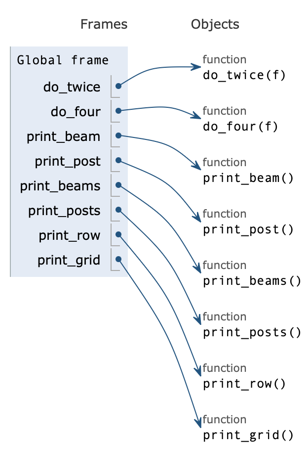
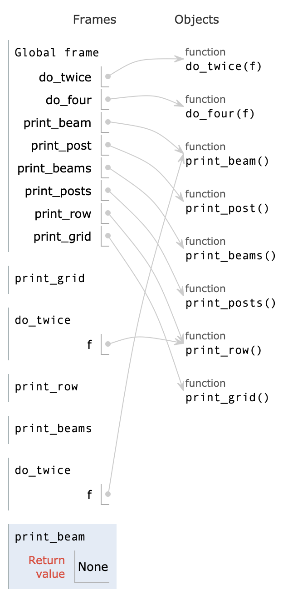

# **Python 计算实验报告**

## **实验目的与要求**

### 熟悉 Python 的函数定义

### 熟悉 Python 的面向对象定义

### 掌握 Python 语言基本语法

## **实验环境**

系统：MacOS 13.2.1 (22D68)
硬件：Apple M1，8G
Python 版本：anaconda Python 3.9.6

## **实验内容**

### **验证实验**

####  **绘制表格函数**

阅读和运行`grid.py`(支持Python2.x，请修改代码使得Python3.x下同样可以正常运行)，分析grid所实现功能中各个函数之间的调用关系，绘制这种调用关系的流程图（可用Visio等软件绘制，流程图放到实验报告中）。比较`grid.py`的实现方法和3(1)中你所实现的绘制表格函数的差异，并且把学习体会写在实验报告中。

#### **分析类功能与同名函数差异**

阅读和运行`myArray.py`和`myMatrix.py`，分析其中类的功能，比较类的定义中同名函数实现上的差异，并写入实验报告。

#### **调试类方法并修正**

阅读和运行`Kangaroo.py`，调用和测试其种所定义的类`Kangaroo`的方法，分析方法实现中的bug，修正，写入实验报告

### **设计实验**

#### **函数和数据结构复习**

1. 编写Ackermann函数的递归实现Ack(m, n)

$$
A(m, n) = 
\begin{cases}
n + 1 & \text{if } m = 0\\
A(m - 1, 1) & \text{if }m > 0 \text{ and } n = 0\\
A(m - 1, A(m, n - 1)) & \text{if }m > 0 \text{ and }n > 0
\end{cases}
$$

2. 编写一个函数，实现从序列中移除重复项，且保持元素间顺序不变。生成随机的列表和字典，验证所实现函数的功能。

#### 类编写

 编写拥有
		a、对像成员`hour`，`minute`和`second`的时间类`Time`；
		b、重载`__str__`和`__add__`方法；
		c、方法`time2int`：把时间对象转换为秒数；
		d、方法`printtime`：输出时间；
		e、方法`isafter`：判断两个时间对象的先后；
		f、方法`increment`：计算对象经过n>0秒后时间；
		g、方法`isvalid`：判断时间对象合法性。
在主函数设计代码验证`Time`各个方法的正确性

#### **马尔可夫文本分析和应用**

(1) 马尔可夫文本分析计算文本中单词组合和其后续单词(含标点符号)的映射，这个单词组合被称为马尔可夫分析的前缀，前缀中单词的个数被称为马尔可夫分析的“阶数”。编写Python代码实现某个文本的n阶马尔可夫文本分析，并且将分析结果记录在字典中。
(2) 采用(1)所实现的马尔可夫分析模块，对“emma.txt”或“whitefang.txt”进行马尔可夫分析，运用n阶马尔可夫分析的结果生成由m个句子(注意首字母大写和结尾标点符号)组成的随机文本。分析所生成文本的语义自然性和阶数n的关系。
(3) 尝试采用Python不同的序列数据结构表示前缀，比较运行效率的差异。

#### **模拟快餐订餐场景**

(1) 定义4个类：`Customer` 顾客类，`Employee` 商户类，`Food` 食物类以及`Lunch` 订餐管理。
(2) `Lunch`类包含`Customer`和`Employee`实例，具有下单`order`方法，该方法要求`Customer`实例调用自身的`placeOrder`向`Employee`对象要求下单，并且获得`Employee`对象调用`takeOrder`生成和返回一个`Food`对象，`Food`对象应当包含了食物名字符串。调用关系如下：`Lunch.order—〉Customer.placeOrder—〉Employee.takeOrder—〉Food`
(3) `Lunch`类包含`result`方法，要求Customer打印所收到的食物订单。
(4) 编写交互式界面验证所设计的订餐系统。

#### **编制系列单词处理函数**

编制系列单词处理函数，分别实现下述功能，并设计测试用例验证程序的正确性，请在实验报告中说明所使用的正则表达式。
(1) 编写函数`rotateword`，接收一个字符串`strsrc`以及一个整数`n`作为参数，返回新字符串`strdes`，其各个字母是`strsrc`中对应位置各个字母在字母表中“轮转”`n`字符后得到的编码。
(2) 编写函数`avoids`，接收一个单词和一个含有禁止字母的字符串，判断该单词是否含有禁止字母。
(3) 编写函数`useonly`，接收一个单词和一个含有允许字母的字符串，判断该单词是否仅仅由允许字母组成。
(4) 编写函数`useall`，接收一个单词和一个含有需要字母的字符串，判断该单词是否包含了所有需要字母至少一个，并输出`words.txt`中使用了所有元音字母`aeiou`的单词。
(5) 编写函数`hasnoe`，判断一个英语单词是否包含字母`e`，并计算`words.txt`中不含`e`的单词在整个字母表中的百分比。
(6) 编写函数`isabecedarian`，判断一个英语单词中的字母是否符合字母表序，并且输出`words.txt`中所有这样的单词。

## **实验内容的设计与实现**

### **验证实验**

####  **绘制表格函数**

阅读和运行`grid.py`(支持Python2.x，请修改代码使得Python3.x下同样可以正常运行)，分析grid所实现功能中各个函数之间的调用关系，绘制这种调用关系的流程图（可用Visio等软件绘制，流程图放到实验报告中）。比较`grid.py`的实现方法和3(1)中你所实现的绘制表格函数的差异，并且把学习体会写在实验报告中。

##### **程序设计特点**

使用函数式编程，将所有的功能实现以函数的形式实现，更加清晰直观。
由于在Python2.x中，print为关键字，与del类似，使用时不需要括号，不可用help(print)查看文档，重定向需要以C风格进行。如需要使用Python3.x的print( )函数需要在开头加入以下导入：

```python
from __future__ import print_function
```

Python3.x中，print( )为默认函数，使用时需要括号，可用help(print)查看文档，重定向只需要修改函数的参数。
将程序在Python3.x中修改为可以运行，只需要将print关键字修改为print( )函数即可。

##### **函数测试：**

```python
# ...
def print_grid():
    do_twice(print_row)
    print_beams()

print_grid()
'''
Output:
+ - - - -+ - - - -+
|        |        |
|        |        |
|        |        |
|        |        |
+ - - - -+ - - - -+
|        |        |
|        |        |
|        |        |
|        |        |
+ - - - -+ - - - -+
'''
# ...
def print_grid():
    one_four_one(print4beams, print_row, nothing)

print_grid()
'''
Output:
+----+----+----+----+
|    |    |    |    |
|    |    |    |    |
|    |    |    |    |
|    |    |    |    |
+----+----+----+----+
|    |    |    |    |
|    |    |    |    |
|    |    |    |    |
|    |    |    |    |
+----+----+----+----+
|    |    |    |    |
|    |    |    |    |
|    |    |    |    |
|    |    |    |    |
+----+----+----+----+
|    |    |    |    |
|    |    |    |    |
|    |    |    |    |
|    |    |    |    |
+----+----+----+----+
'''
```

##### **函数/代码分析：**

<table style="border: 0;">
    <tr>
        <td>
        	
        </td>
        <td>
        	
        </td>
    </tr>
    <tr>
        <td>
            图1 Python运行流程 函数定义
        </td>
        <td>
        	图2 Python运行流程 函数调用与嵌套
        </td>
    </tr>
</table>

与个人实现的函数对比，模版函数通过定义`do_twice()`、`do_four()`、`do_twice()`、`onefourone()`等以函数为参数的函数，合理利用函数嵌套，简化了编写过程，增强可读性，在设计过程中需要对函数调用有清楚的理解才能设计出更好的程序。

#### **分析类功能与同名函数差异**

阅读和运行`myArray.py`和`myMatrix.py`，分析其中类的功能，比较类的定义中同名函数实现上的差异，并写入实验报告。

##### **程序设计特点**

`myArray.py`中定义了名为`MyArray`的类，其方法与`NumPy`中的`array`类一致。
`myMatrix`中定义了名为`simNumpyArray`的类，其方法与`NumPy`中的`Matrix`类一致。

##### **函数测试：**

```python
# myArray.py
# 创建一个测试数组
arr = MyArray(1, 2, 3, 4, 5)
print(f"Array: {arr}")

# 数组的基本运算
print("Array + 2:", arr + 2)
print("Array - 2:", arr - 2)
print("Array * 2:", arr * 2)
print("Array / 2:", arr / 2)
print("Array // 2:", arr // 2)
print("Array % 2:", arr % 2)
print("Array ** 2:", arr**2)
print("len(Array):", len(arr))
print("Array[2]:", arr[2])
print("Array[2, 3]:", arr[2, 3])
arr.append(0)
print("Array.append(0):", arr)
arr[0] = 10
print("Array[len(Array) - 1] = 10:", arr)
print("10 in Array:", 10 in arr)
print("Array.dot(Array):", arr.dot(arr))

"""
Output:
Array: [1, 2, 3, 4, 5]
Array + 2: [3, 4, 5, 6, 7]
Array - 2: [-1, 0, 1, 2, 3]
Array * 2: [2, 4, 6, 8, 10]
Array / 2: [0.5, 1.0, 1.5, 2.0, 2.5]
Array // 2: [0, 1, 1, 2, 2]
Array % 2: [1, 0, 1, 0, 1]
Array ** 2: [1, 4, 9, 16, 25]
len(Array): 5
Array[2]: 3
Array[2, 3]: [3, 4]
Array.append(0): [1, 2, 3, 4, 5, 0]
Array[len(Array) - 1] = 10: [10, 2, 3, 4, 5, 0]
10 in Array: True
Array.dot(Array): 154
"""
```

```python
#myMatrix.py
# 创建两个2x2的矩阵
a = simNumpyArray([1, 2, 3, 4])
b = simNumpyArray([5, 6, 7, 8])
print(list(map(str, [[5], [6], [7], [8]])))
print("a: ", a)
print("b: ", b)

# 输出变形后的矩阵
a.reshape((2, -1))
b.reshape((2, -1))
print(f"a.reshape(2, -1): \n{a}")
print(f"b.reshape(2, -1): \n{b}")

# 输出矩阵的转置
print(f"a的转置: \n{a.T}")
print(f"b的转置: \n{b.T}")

print(f"a + b: \n{a + b}")
print(f"a - b: \n{a - b}")
print(f"a * 2: \n{a * 2}")
print(f"a * b: \n{a * b}")
print(f"a / 2: \n{a / 2}")
print(f"a // 2: \n{a // 2}")
print(f"a ** 2: \n{a**2}")
print(f"a * b: \n{a * b}")
print(f"a == b: \n{a == b}")
print(f"a < b: \n{a < b}")
print(f"print(i for i in a, end=''): \n{[i for i in a]}")
print(f"a.Sin:  \n{a.Sin}")
print(f"a.Cos:  \n{a.Cos}")

'''
Output:
b:  [5, 6, 7, 8]
a.reshape(2, -1): [1, 2]
				  [3, 4]
b.reshape(2, -1): [5, 6]
				  [7, 8]
a的转置: [1, 3]
		[2, 4]
b的转置: [5, 7]
		[6, 8]
a + b: 	[6, 8]
	   	[10, 12]
a - b: 	[-4, -4]
	   	[-4, -4]
a * 2: 	[2, 4]
	  	[6, 8]
a * b:	[19, 22]
		[43, 50]
a / 2: 	[0.5, 1.0]
		[1.5, 2.0]
a // 2: [0, 1]
		[1, 2]
a ** 2: [1, 4]
		[9, 16]
a * b: 	[19, 22]
		[43, 50]
a == b: False
a < b: 	True
print(i for i in a, end=''): [[1, 2], [3, 4]]
a.Sin:  [0.8414709848078965, 0.9092974268256817]
		[0.1411200080598672, -0.7568024953079282]
a.Cos:  [0.5403023058681398, -0.4161468365471424]
		[-0.9899924966004454, -0.6536436208636119]
'''
```

##### **函数/代码分析：**

经过测试可知，以上两个类并未重载运算符，仅对类的运算函数进行重载，因而使得在与基础数据类型运算时，基础数据类型只能位于运算符后，否则将产生报错。
此外，若需要定义$m*n$的矩阵，只能先线性的定义需要定义的矩阵的行展开向量，而后使用`reshape()`方法将其转化为目标矩阵。
需要注意的是，`myArray.py`与`myMatrix.py`没有重载拷贝函数，因此当使用`=`制作副本时，只能得到对象的`shallow copy`，其指向数据域的指针相同。因此当使用这两个模块时，拷贝必须使用`copy()`实现。

#### **调试类方法并修正**

阅读和运行`Kangaroo.py`，调用和测试其种所定义的类`Kangaroo`的方法，分析方法实现中的bug，修正，写入实验报告

##### **程序设计特点**

在`Kangaroo.py`中，定义了类`Kangaroo`，其初始化函数参数为`contents = []`

##### **函数测试**

```python
kanga = Kangaroo()
roo = Kangaroo()
kanga.put_in_pouch("wallet")
kanga.put_in_pouch("car keys")
kanga.put_in_pouch(roo)

print(kanga)
print(roo)

'''
Output:
<__main__.Kangaroo object at 0x7fbd7890bdc0> with pouch contents:
    'wallet'
    'car keys'
    <__main__.Kangaroo object at 0x7fbd58507dc0>
<__main__.Kangaroo object at 0x7fbd58507dc0> with pouch contents:
    'wallet'
    'car keys'
    <__main__.Kangaroo object at 0x7fbd58507dc0>
'''
```

##### **函数/代码分析**

经过测试可知，当`print(roo)`时，预期没有输出，而实际中`roo`与`kang`拥有了相同的`pouch_contents`，检查代码可发现，由于初始化函数定义为`content = []`，受到python调度机制的影响，只有第一次调用初始化函数时，`contents`才会初始化为空列表，而后续的调用过程中，所有`kangaroo`的成员都使用了指向第一次初始化时创建的`contents`列表，因此后创建的对象会同时拥有先创建的对象的所有`pouch_contents`。
因此，需要将`contents`的默认参数修改为`None`，以此判断是否需要将其初始化，从而解决此bug。

```python
# 修改后的代码
class Kangaroo(object):
    """a Kangaroo is a marsupial"""

    def __init__(self, contents=None):
        #...

kanga = Kangaroo()
roo = Kangaroo()
kanga.put_in_pouch("wallet")
kanga.put_in_pouch("car keys")
kanga.put_in_pouch(roo)

print(kanga)
print(roo)

'''
Outrput:
<__main__.Kangaroo object at 0x7f91b87beeb0> with pouch contents:
    'wallet'
    'car keys'
    <__main__.Kangaroo object at 0x7f91b87bed60>
<__main__.Kangaroo object at 0x7f91b87bed60> with pouch contents:
'''
```

### **设计实验**

#### **函数和数据结构复习**

##### **编写Ackerman函数的递归实现Ack(m, n)**

$$
A(m, n) = 
\begin{cases}
n + 1 & \text{if } m = 0\\
A(m - 1, 1) & \text{if }m > 0 \text{ and } n = 0\\
A(m - 1, A(m, n - 1)) & \text{if }m > 0 \text{ and }n > 0
\end{cases}
$$

###### 程序设计特点

使用递归，快速完成程序设计。

###### 函数测试

``` python
def Ack(m: int, n: int) -> int:
    return n + 1 if not m else Ack(m - 1, 1) if m > 0 and not n else Ack(m - 1, Ack(m, n - 1))

print(Ack(3, 4))
```

输出结果为`125`

###### 函数/代码分析

练习使用python三目运算符`ans1 if bool_judge else ans2`

##### **有序移除重复项**

编写一个函数，实现从序列中移除重复项，且保持元素间顺序不变。生成随机的列表和字典，验证所实现函数的功能。

###### 程序设计特点

随机生成`list`与`dict`，并定义通用去重函数`RmRepeated(items, key = None)`为函数去重，其中`key`为待去重对象的元素格式。

###### 函数测试

```python
def RmRepeated(items, key = None) -> iter:
    seen = set()
    for item in items:
        val = item if key is None else key(item)
        if val not in seen:
            yield item
            seen.add(val)
            
def main():
    low, high, size = 0, 5, 10
    lists = GenerateRandomList(low, high, size)
    print("Generate Random List:")
    print(lists)
    print("Removed List:")
    print(list(RmRepeated(lists)))
    dict_key = (2, 4)
    dicts = GenerateRandomDict(low, high, size, dict_key)
    print("Generate Random Dicts:")
    print(dicts)
    print("Removed Dicts:")
    print(list(RmRepeated(dicts, lambda dic: (tuple(dic.values()), 
                                              tuple(dic.values())))))

'''
Output:
Generate Random List:
[2, 1, 2, 3, 4, 4, 3, 1, 3, 4]
Removed List:
[2, 1, 3, 4]
Generate Random Dicts:
[{2: 4, 1: 4}, {4: 4, 0: 4}, {4: 3, 2: 0}, {2: 0, 1: 1}, {2: 2, 1: 4}, {0: 2, 4: 0}, {4: 1, 2: 2}, {2: 1, 0: 0, 1: 0}, {4: 2, 1: 2}, {3: 4, 2: 2}]
Removed Dicts:
[{2: 4, 1: 4}, {4: 3, 2: 0}, {2: 0, 1: 1}, {2: 2, 1: 4}, {0: 2, 4: 0}, {4: 1, 2: 2}, {2: 1, 0: 0, 1: 0}, {4: 2, 1: 2}, {3: 4, 2: 2}]
'''
```

###### 函数/代码分析

定义通用去重函数`RmRepeated(items, key = None)`，使用`set`以判断当前元素是否已出现，若尚未出现则将其加入`set`并使用`yeild`返回以节省内存空间。然而由于`set`结构仅适用于可哈希对象，因此，对于元素为普通数据结构的`list`去重时，由于`list`元素无特定格式，因此只需要直接读取；而对于元素为`dict`或`list`的`list`，由于元素本身不可哈希，因此在存入`set`中时需要根据`key`将元素转化为可哈希类型。以`dict`元素为例，由于键值对一一对应，因此转化为可哈希对象后也需要一一对应，因此分别将其`keys`与`values`转化为`tuple`对象，并将两个`tuple`对象放入一个`tuple`对象中，其对应的`lambda`表达式为：`lambda dic: (tuple(dic.values()), tuple(dic.values()))`，如果是`list`元素，则其对应的`lambda`表达式应为`lambda lst: tuple(lst)`。
此外，通过使用`yield`返回去重对象，减少内存开销。

#### **Time类编写**

 编写拥有
		a、对像成员`hour`，`minute`和`second`的时间类`Time`；
		b、重载`__str__`和`__add__`方法；
		c、方法`time2int`：把时间对象转换为秒数；
		d、方法`printtime`：输出时间；
		e、方法`isafter`：判断两个时间对象的先后；
		f、方法`increment`：计算对象经过n>0秒后时间；
		g、方法`isvalid`：判断时间对象合法性。
在主函数设计代码验证`Time`各个方法的正确性

##### **程序设计特点**

`__isNumber(n)`: 初步判断数据是否合法；
`legalize()`: 将`Time`对象记录的合法化，使其它方法的编写更为简洁且有可读性。

##### **函数测试**

```python
a = Time(0, 0, 1000)
b = Time(23, 59, 0)
print(f"a.isvalid(): {a.isvalid()}")
print(f'a: {a}')
print(f"a.isvalid(): {a.isvalid()}")
print(f"b.printtime(): {b.printtime()}", end='')
print(f"a.time2int(): {a.time2int()}")
print(f"a + b: {a + b}")
print(f"a.isafter(b): {a.isafter(b)}")
print(f"a.increment(100): {a.increment(100)}")

'''
Output:
a.isvalid(): False
a: 00:16:40
a.isvalid(): True
23:59:00
b.printtime(): Nonea.time2int(): 1000
a + b: 00:15:40
a.isafter(b): False
a.increment(100): 00:18:20
'''
```

##### **函数/代码分析**

由于程序设计原因，输出时将自动合法化时间，因此不合法时间可能在输出后自动换算为合法时间。

#### **马尔可夫文本分析和应用**

(1) 马尔可夫文本分析计算文本中单词组合和其后续单词(含标点符号)的映射，这个单词组合被称为马尔可夫分析的前缀，前缀中单词的个数被称为马尔可夫分析的“阶数”。编写Python代码实现某个文本的n阶马尔可夫文本分析，并且将分析结果记录在字典中。
(2) 采用(1)所实现的马尔可夫分析模块，对“emma.txt”或“whitefang.txt”进行马尔可夫分析，运用n阶马尔可夫分析的结果生成由m个句子(注意首字母大写和结尾标点符号)组成的随机文本。分析所生成文本的语义自然性和阶数n的关系。
(3) 尝试采用Python不同的序列数据结构表示前缀，比较运行效率的差异。

##### **程序设计特点**

定义了`MarkovChain`类，并设计了私有方法`__GetSubStrings(TrainningSet: str, step: int)-> list[str]`与`__CreateTransitionMatrix()->dict[str: dict[str: int]]`用于生成马尔可夫状态转移矩阵（字典），并使用`Generate(max: int = 10)`方法生成马尔可夫文本。

##### **函数测试**

```python
class MarkovChain:
	def __init__(self, TrainningSet: str, step: int, len: int = 10):
        # ...
        pass

    def __GetSubStrings(self, TrainningSet: str, step: int) -> list[str]:
        # ...
        pass

    def __CreateTransitionMatrix(self)->dict[str: dict[str: int]]:
        # ...
        pass
        
    def Generate(self, max: int = 10) -> str:
        # ...
		pass
    
if __name__ == '__main__':
    step = 5
    src_dir = sys.path[0]
    data_dir = "./../Data"
    file_name = "emma.txt"
    with open(src_dir + "/" + data_dir + "/" + file_name, "r") as file:
        MC = MarkovChain(file.read(), step)
        pprint(MC.Generate())
        
'''
Output1:
she would ever submit to would ever submit to she ever submit to she played submit to she played and to she played and sangand she played and sangand drewin played and sangand drewin almost and sangand drewin almost every sangand drewin almost every style drewin almost every style but almost every style but steadiness
Output2:
shark give me the paper give me the paper and me the paper and listenfor the paper and listenfor miss paper and listenfor miss read and listenfor miss read miss listenfor miss read miss smith miss read miss smith my read miss smith my first miss smith my first displays smith my first displays the
'''
```

##### **函数/代码分析**

通过多次测试，可以发现，随着马尔可夫文本分析阶数的上升，文本的语意自然性随之加强，但是由于马尔可夫链算法本身的局限，当阶数较大时，其生成文本有较大可能与训练文本重复，因此多次测试后，本题取`n = 5`处理训练文本。
在清理训练文本时，`__GetSubStrings(TrainningSet: str, step: int)-> list[str]`通过使用正则表达式`[^A-Za-z ]`提取每一个非字符/空格并以此为截断点，从而提取文本中的单词，实现数据清洗，获得全小写字符串数组`word: list[str]`，并根据设置的阶数生成一个列表`list[list[str]]`，其长度为`int(len(words) / step) + 1`、每个元素为包含 $n$ 个单词的列表，并将其保存至私有成员`__SubStrings`。
`__CreateTransitionMatrix(self)->dict[str: dict[str: int]]`根据`__GetSubStrings(TrainningSet: str, step: int)-> list[str]`返回的列表，统计每一个长度为 $n$ 的字符串的后继单词的频率，并将其归一化，从而获得马尔可夫状态转移矩阵`TM: dict[str: dict[str: int]]`并将其保存至私有成员`__TransitionMatrix`。
最后，通过调用`Generate(max: int = 10)`，生成马尔可夫文本。

#### **模拟快餐订餐场景**

(1) 定义4个类：`Customer` 顾客类，`Employee` 商户类，`Food` 食物类以及`Lunch` 订餐管理。
(2) `Lunch`类包含`Customer`和`Employee`实例，具有下单`order`方法，该方法要求`Customer`实例调用自身的`placeOrder`向`Employee`对象要求下单，并且获得`Employee`对象调用`takeOrder`生成和返回一个`Food`对象，`Food`对象应当包含了食物名字符串。调用关系如下：`Lunch.order—〉Customer.placeOrder—〉Employee.takeOrder—〉Food`
(3) `Lunch`类包含`result`方法，要求Customer打印所收到的食物订单。
(4) 编写交互式界面验证所设计的订餐系统。

##### **程序设计特点**

定义了4个类：`Customer` 顾客类，`Employee` 商户类，`Food` 食物类以及`Lunch` 订餐管理，实现类的嵌套调用。

##### **函数测试**

```python
def main():
    customer = Customer('Yui')
    employee = Employee('KFC')
    lunch = Lunch(customer, employee)
    while True:
        print('''
订餐系统：
1.订餐 
2.查看所有
0.退出
        '''.strip())
        choice = input('请选择功能: ')
        if choice == '0':
            break
        elif choice == '1':
            name = input('请输入食物名称: ')
            lunch.order(name)
        elif choice == '2':
            for i in lunch.result():
                print(i._FoodName)
                
'''
Output:
订餐系统：
1.订餐 
2.查看所有
0.退出
请选择功能: 1
请输入食物名称: 老八小憨包
订餐系统：
1.订餐 
2.查看所有
0.退出
请选择功能: 1
请输入食物名称: 铁锅炖自己
订餐系统：
1.订餐 
2.查看所有
0.退出
请选择功能: 2
老八小憨包
铁锅炖自己
订餐系统：
1.订餐 
2.查看所有
0.退出
请选择功能: 0
'''
```

##### **函数/代码分析**

`Food`：包含了食物名字符串成员`_FoodName`与点单完成判断成员`_Complete`；
`Customer`：包含成员`_CustomerName`和方法`place_order(_FoodName: str) -> Food`；
`Employee`：包含成员`_EmployeeName`和方法`take_order(_Food: Food) -> None`，其方法作用为标记`Food`对象为已完成点单；
`Lunch`类包含`_customer: Customer`、`_employee: Employee`和`_orders: list[Food]`实例，具有下单`order`方法：要求`Customer`实例调用自身的`place_order`向`Employee`对象要求下单，并且获得`Employee`对象调用`take_order`生成和返回一个`Food`对象；具有返回已完成点单的`Food`列表`result`的方法：返回`_orders: list[Food]`
调用关系如下：`Lunch.order—〉Customer.placeOrder—〉Employee.takeOrder—〉Food`

#### **编制系列单词处理函数**

编制系列单词处理函数，分别实现下述功能，并设计测试用例验证程序的正确性，请在实验报告中说明所使用的正则表达式。
(1) 编写函数`rotateword`，接收一个字符串`strsrc`以及一个整数`n`作为参数，返回新字符串`strdes`，其各个字母是`strsrc`中对应位置各个字母在字母表中“轮转”`n`字符后得到的编码。
(2) 编写函数`avoids`，接收一个单词和一个含有禁止字母的字符串，判断该单词是否含有禁止字母。
(3) 编写函数`useonly`，接收一个单词和一个含有允许字母的字符串，判断该单词是否仅仅由允许字母组成。
(4) 编写函数`useall`，接收一个单词和一个含有需要字母的字符串，判断该单词是否包含了所有需要字母至少一个，并输出`words.txt`中使用了所有元音字母`aeiou`的单词。
(5) 编写函数`hasnoe`，判断一个英语单词是否包含字母`e`，并计算`words.txt`中不含`e`的单词在整个字母表中的百分比。
(6) 编写函数`isabecedarian`，判断一个英语单词中的字母是否符合字母表序，并且输出`words.txt`中所有这样的单词。

##### **程序设计特点**

使用正则表达式处理字符串，使字符判断规则定义更简洁。

##### **函数测试**

```python
def main() -> None:
    src_dir = sys.path[0]
    data_dir = "./../Data"
    file_name = "words.txt"

    words_useall_aeiou = []
    words_hasnoe = []
    words_isabecedarian = []
    with open(src_dir + "/" + data_dir + "/" + file_name, "r") as file:
        words = set(file.read().split())
        for word in words:
            words_useall_aeiou.append(word) if useall(word, "aeiou") else None
            words_hasnoe.append(word) if hasnoe(word) else None
            words_isabecedarian.append(word) if isabecedarian(word) else None

    teststr = "ILovePython"

    print('rotate(\"ILovePython)\" by 5:', rotateword(teststr, 5))
    print('rotate(\"ILovePython)\" by 30:', rotateword(teststr, 30))
    print("avoids(\"ILovePython\", \"abcd\"):", avoids(teststr, "abcd"))
    print("avoids(\"ILovePython\", \"abcdo\"):", avoids(teststr, "abcdo"))
    print("useonly(\"ILovePython\", \"abcde\"):", useonly(teststr, "abcde"))
    print("useonly(\"ILovePython\", \"a-zA-Z\"):", useonly(teststr, "a-zA-Z"))
    print("useall(\"ILovePython\", \"LoveU\"):", useall(teststr, "LoveU"))
    print("useall(\"ILovePython\", \"Love\"):", useall(teststr, "Love"))
    print("hasnoe(\"task\"):", hasnoe("task"))
    print("hasnoe(\"ILovePython\"):", hasnoe(teststr))
    print("isabecedarian(\"ILovePython\"):", isabecedarian(teststr))
    print("isabecedarian(\"abcdhlz\"):", isabecedarian("abcdhlz"))
    print("Words use all aeiou:", words_useall_aeiou)
    print(f"Percents of words has no e: {len(words_hasnoe) / len(words) * 100: .2f}%")
    print("Words is abecedarian:", words_isabecedarian)
    return

'''
Output:
rotate("ILovePython)" by 5: NQtajUdymts
rotate("ILovePython)" by 30: MPsziTcxlsr
avoids("ILovePython", "abcd"): False
avoids("ILovePython", "abcdo"): True
useonly("ILovePython", "abcde"): False
useonly("ILovePython", "a-zA-Z"): True
useall("ILovePython", "LoveU"): False
useall("ILovePython", "Love"): True
hasnoe("task"): True
hasnoe("ILovePython"): False
isabecedarian("ILovePython"): False
isabecedarian("abcdhlz"): True
Words use all aeiou: ['hallucinogenic', 'fastiduousness', ...]
Percents of words has no e:  33.07%
Words is abecedarian: ['bis', 'ado', 'jo', ...]
'''
```

##### **函数/代码分析**

`rotateword(strsrc: str, n: int) -> str`：遍历输入字符串，如果当前字符属于大/小写字母，则获取其对于`"A"`/`"a"`的ASCII偏移量，而后加上`n`并对26取模，最后重新加上`"A"`/`"a"`的ASCII码值；
`avoids(strsrc: str, avoidchar: str) -> bool`：使用正则表达式`"[{avoidchar}]"`作为匹配条件，如果成功匹配则表明该单词含有禁止字母，返回`True`；
`useonly(strsrc: str, availablechar: str) -> bool`：使用正则表达式`"^[{availablechar}]*$"`作为匹配条件，匹配对象为全由`abailablechar`字符串中的字母组成的单词，从传入字符串的开始匹配到其结尾，如果匹配成功则表明该单词仅仅由允许字母组成，返回`True`；
`useall(strsrc: str, availablechar: str) -> bool`：通过遍历`abailablechar`，如果其中的字母在目标单词中（使用`in`），则继续运行，否则返回`False`，若遍历结束仍未返回，表明该单词包含了所有需要字母组成，返回`True`；
`hasnoe(strsrc: str) -> bool`：调用`avoids(strsrc, "e")`，若返回值为`True`则说明单词存在e，返回`False`，反之亦然；
`isabecedarian(strsrc: str) -> bool`：遍历单词，判断其字母的ASCII码是否递增，若出现后继字母小于前字母，则返回`Flase`，直到遍历完成，返回`True`；

## **测试用例：**

本次实验中第2.3题的训练用例为`emma.txt`，第2.5题的测试用例为`words.txt`。

## **收获与体会**

 通过本次实验，我对 Python 的流程控制，第三方库的调用、泛函数、函数嵌套、灵活利用基础数据结构进行算法设计与完整的Python类编写有了更深一步的理解，通过练习与实验，我深刻的体会到当设计一个程序时，应当从其数据结构入手了解。
