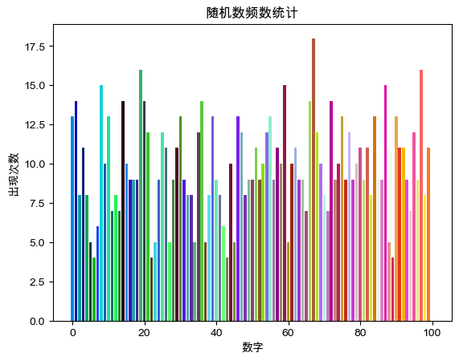

# 第1-6章课后作业
## 第一章
1. 简单说明如何选择正确的Python版本。
    
    选择Python版本时应根据自己的需求和必须的扩展库支持的版本决定

2. 为什么说Python采用的是基于值的内存管理模式？

    不同变量赋相同值时享用同一内存空间


```python
a = 1
b = 1
print(id(a) == id(b))
```

    True


3. 解释Python中的运算符 `/` 和 `//` 的区别

    `/` 为普通的浮点数除法，`//` 为整除

4. 在Python中导入模块中的对象有哪几种方式？

    import 模块名 (as 别名)

    from 模块名 import 模块名/函数名/* (as 别名) 

5. <u>Conda 和 PyPI</u> 是目前比较常用的Python扩展库管理工具

6. 解释Python脚本程序的__name__变量及其作用。

    Python的__name__变量储存当前运行的Python脚本或模块的名称，直接执行一段脚本的时候，这段脚本的__name__变量等于main，当这段脚本被导入其他程序的时候，__name__变量等于脚本本身的名字

7. 运算符<u>可以</u>对浮点数进行求与树操作。
8. 一个数字5<u>是</u>合法的Python表达式。
9. 在Python 2.x中，`input()`函数接收到的数据类型由<u>输入的内容</u>，而在Python 3.x中概函数则认为接收到的用户输入数据一律为<u>`str`</u>
10. 编写程序，用户输入一个三位以上的整数，输出其百位以上的数字。例如用户输入`1234`，则程序输入`12`（提示：使用整除运算）


```python
# input 1234
print(int(input("请输入一个三位以上的整数：")) // 100)
```

    12


## 第二章

1. 为什么应尽量从列表的尾部进行元素的增加与删除操作？

    因为Python中的列表底层是数组，因此尾部操作效率更高

2. `range()`函数在Python 2.x中返回一个<u>列表</u>，而Python 3.x的range()函数返回一个<u>迭代器</u>

3. 编写程序，生成包含1000个0～100之间的随机整数，并统计每个元素的出现次数。


```python
import random
from matplotlib import pyplot as plt

nums = [random.randint(0, 100) for i in range(1000)]
x_data = [i for i in range(101)]
y_data = count = [0 for i in range(101)]

for i in nums:
    count[i] += 1

plt.rcParams['font.sans-serif'] = ['Arial Unicode MS']
plt.rcParams['axes.unicode_minus']=False

# 画图，plt.bar()可以画柱状图
for i in range(len(x_data)):
    colors = str(hex(0xFFFFFF // 101 * (i + 1)))[2:]
    colors = "#" + ("0" if len(colors) < 6 else "") + colors
    plt.bar(x_data[i], y_data[i], color = colors)
# 设置图片名称
plt.title("随机数频数统计")
# 设置x轴标签名
plt.xlabel("数字")
# 设置y轴标签名
plt.ylabel("出现次数")
# 显示
plt.show()
```


    

    


4. 表达式“`[3] in [1, 2, 3, 4]`”的值为<u>False</u>

5. 编写程序，用户输入一个列表和2个整数作为下标，然后输出列表中介于2个下标之间的元素组成的字列表。例如用户输入`[1, 2, 3, 4, 5, 6]`和`2, 5`，程序输出`[3, 4, 5, 6]`。


```python
# input: [1, 2, 3, 4, 5, 6] 2 5
nums = eval(input('list: '))
minimum = int(input('minimum: '))
maximum = int(input('maximum: '))
print(nums[minimum : maximum + 1])
```

    [3, 4, 5, 6]


6. 列表对象的`sort()`方法用来对列表元素进行原地排序，该函数返回值为<u>`NoneType`</u>


```python
a = [1, 2, 3, 4, 5, 6]
print(type(a.sort()))
```

    <class 'NoneType'>


7. 列表对象的<u>`remove()`</u>方法删除首次出现的制定元素，如果列表中不存在要删除的元素，则抛出异常。

8. 假设列表对象`aList`的值为`[3, 4, 5, 6, 7, 9, 11, 13, 15, 17]`，那么切片`aList[3:7]`得到<u>`[6, 7, 9, 11]`</u>

9. 设计一个字典，并编写程序，用户输入内容作为“键”，然后输出字典中对应的“值”，如果用户输入的“键”不存在，则输出“您输入的键不存在！”。


```python
dictionary = {"a" : 1, "b" : 2, "c" : 3}
while True:
    key = input("请输入键：")
    if key == "":
        break
    elif key in dictionary.keys():
        print("key: %s\nval: %d\n"%(key, dictionary[key]))
    else:
        print("key: %s\n您输入的键不存在！\n"%key)

```

    key: a
    val: 1
    
    key: b
    val: 2
    
    key: c
    val: 3
    
    key: d
    您输入的键不存在！
    


10. 编写程序，生成包含20个随机数的列表，然后将前10个元素升序排列，后10个元素降序排列，并输出结果。


```python
from random import randint

nums = [randint(0, 100) for i in range(20)]
front = nums[:10]
front.sort()
back = nums[10:]
back.sort(reverse=True)

print(front)
print(back)
```

    [9, 13, 16, 16, 33, 43, 50, 75, 86, 98]
    [94, 82, 78, 70, 67, 49, 48, 31, 18, 1]


11. 在Python中，字典和集合都是用一对<u>花括号</u>作为界定符，字典的每个元素有两部分组成，即<u>键</u>和<u>值</u>，其中<u>键</u>不允许重复。

12. 使用字典对象的<u>items()</u>方法可以返回字典的“键-值对”列表，使用字典对象的<u>keys()</u>方法可以返回字典的“键”列表，使用字典对象的<u>values()</u>方法可以返回字典的“值”列表。

13. 假设有列表`a = ['name', 'age', 'sex']`和`b = ['Dong', 38, 'Male']`，请使用一个语句将这两个列表的内容转化为字典，并且以列表`a`中的元素为“键”，以列表`b`中的元素为“值”，这个语句可以写为<u>`dict(zip(a, b))`</u>

14. 假设有一个列表`a`，现要求从列表`a`中每3个元素取1个，并且将取到的元素组成新的列表`b`，可以使用语句<u>`b = a[::3]`</u>

15. 使用列表推导式生成包含10个数字5的列表，语句可以写为<u>`[5 for i in range(10)]`</u>

16. <u>可以</u>使用`del`命令来删除元组中的部分数据。

## 第三章

1. 分析逻辑运算符`or`的短路求值特性。

    逻辑运算符`or`的短路求值特性：当`or`左边的表达式为`True`后，就不再计算右边的表达式，直接返回`True`。

2. 编写程序，运行后用户输入4位整数作为年份，判断其是否为闰年。如果年份能被400整除，则为闰年；如果年份能被4整除但不能被100整除也为闰年。


```python
for i in range(4):
    year = int(input("请输入年份(四位整数): "))
    print("请输入年份(四位整数): %d"%year)
    if year % 400 == 0 or year % 4 == 0 and year % 100 != 0:
        print("%s是闰年"%year)
    else:
        print("%s不是闰年"%year)
```

    请输入年份(四位整数): 2000
    2000是闰年
    请输入年份(四位整数): 1900
    1900不是闰年
    请输入年份(四位整数): 2020
    2020是闰年
    请输入年份(四位整数): 2023
    2023不是闰年


3. Python提供了两种基本的循环结构：<u>`for`</u>和<u>`while`</u>

4. 编写程序，生成一个包含50个随机整数的列表，然后删除其中所有奇数（提示：从后向前删）。


```python
from random import randint

nums = [randint(0, 100) for i in range(50)]

for i in range(len(nums) - 1, -1, -1):
    if nums[i] % 2:
        del nums[i]
print(nums)
```

    [18, 22, 28, 2, 84, 72, 58, 42, 36, 14, 68, 100, 34, 30, 34, 70, 40, 96, 96, 86, 30, 90, 18, 88, 20, 0, 72]


5. 编写程序，生成一个包含20个随机整数的列表，然后对其中偶数下标的元素进行降序排列，奇数下标的元素不变（提示：使用切片）。


```python
from random import randint

nums = [randint(1, 100) for i in range(20)]
nums_o = nums[::2]
nums_o.sort(reverse=True)

for i in range(10):
    nums[i * 2] = nums_o[i]
print(nums)
```

    [86, 41, 75, 49, 65, 17, 60, 35, 59, 9, 49, 10, 31, 92, 31, 66, 21, 86, 7, 45]


6. 编写程序，用户从键盘输入小于1000的整数，对其进行因式分解。例如，$10 = 2 \times 5$，$60 = 2 \times 2 \times 3 \times 5$。


```python
def IsPrime(num:'int > 0'):
    if num <= 1:
        return False
    if num == 2 or num == 3:
        return True
    if num % 2 == 0:
        return False
    for i in range(3, int(num ** 0.5) + 1, 2):
        if num % i == 0:
            return False
    return True

def Factorization(num:'int > 0'):
    temp = num
    factors = []
    min_factor = 2
    if IsPrime(num) or num == 1:
        factors.append(str(num))
        temp /= num
    while min_factor <= temp:
        if temp % min_factor == 0:
            factors.append(str(min_factor))
            temp /= min_factor
        else:
            min_factor += 1 if min_factor == 2 else 2w
    print("%d = %s"%(num, ' * '.join(factors)))


num = int(input("请输入小于1000的整数以因式分解: "))
print("请输入小于1000的整数以因式分解: %d"%num)
Factorization(num)

```

    请输入小于1000的整数以因式分解: 60
    60 = 2 * 2 * 3 * 5


7. 编写程序，至少使用两种不同方法计算100以内所有奇数的和。


```python
ans1 = sum([i for i in range(1, 100, 2)])
ans2 = int((1 + 99) * 50 / 2)
print("%d %d"%(ans1, ans2))
```

    2500 2500


8. 编写程序，输出所有由1、2、3、4这四个数字组成的素数，并且在每个素数种每个数字只使用一次。


```python
import itertools
from pprint import pprint

def IsPrime(num:'int > 0'):
    if num <= 1:
        return False
    if num == 2 or num == 3:
        return True
    if num % 2 == 0:
        return False
    for i in range(3, int(num ** 0.5) + 1, 2):
        if num % i == 0:
            return False
    return True

# 利用itertools库中的permutations函数,给定一个排列,输出他的全排列
def allPermutation(src:"list"):
    permutation = []
    for i in range(len(src)):
        permutation.append(src[i])
    # itertools.permutations返回的只是一个对象,需要将其转化成list
    # 每一种排列情况以元组类型存储
    all_permutation = list(itertools.permutations(permutation))
    return all_permutation

nums = [1, 2, 3, 4]
permutation = allPermutation([str(i) for i in nums])
pnums = [int(''.join(i)) for i in permutation]
for num in pnums:
    if IsPrime(num):
        print(num)

```

    1423
    2143
    2341
    4231


9. 编写程序，实现分段函数计算，如表3-11111所示。

    |      $x$       |    $y$     |
    | :------------: | :--------: |
    |    $x < 0$     |    $0$     |
    | $0 \le x < 5$  |    $x$     |
    | $5 \le x < 0$  |  $3x - 5$  |
    | $10 \le x <20$ | $0.5x - 2$ |
    |   $20 \le x$   |    $0$     |


```python
def func(x):
    if x < 0:
        return 0
    if 0 <= x and x < 5:
        return x
    if 5 <= x and x < 10:
        return 3 * x - 5
    if 10 <= x and x < 20:
        return 0.5 * x - 2
    else:
        return 0

print(func(-1))
print(func(2))
print(func(8))
print(func(15))
print(func(25))
```

    0
    2
    19
    5.5
    0

